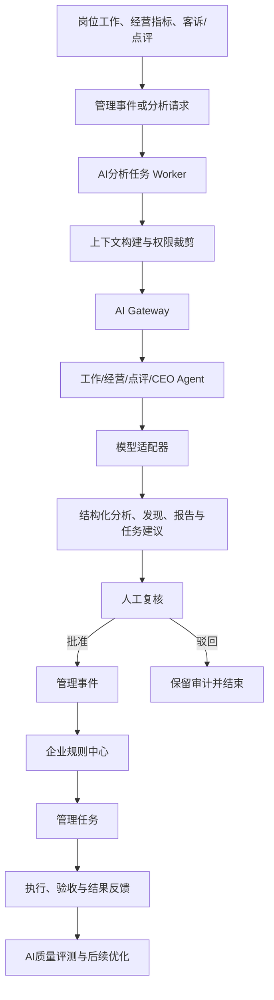

# Hotel AI OS Sprint 3 AI进入管理闭环详细实施方案

| 项目 | 计划基线 |
|---|---|
| 方案版本 | S3-PLAN-V1.1 |
| 编制日期 | 2026-07-18 |
| 产品基线 | PRODUCT-V1.2 / 蓝图修订R1.1，不改变冻结管理链 |
| 当前正式技术版本 | TECH-V0.1 |
| 前置发布候选 | TECH-V0.2 / DB-V13 / OpenAPI 0.2.1-sprint2.1，当前仍为Unreleased |
| Sprint 3目标候选 | TECH-V0.3 |
| API策略 | 保持API-V1与`/api/v1`向后兼容；候选契约为0.3.0-sprint3 |
| 数据库策略 | 仅在DB-V13正式发布后新增V14+，不得修改V1—V13 |
| 建议周期 | 18个工作日，不包含TECH-V0.2发布收口 |
| 建议团队 | 后端2人、前端1人、QA/AI评测1人、技术负责人1人（可兼任） |
| 当前状态 | 计划已输出 / 待技术冻结 / 未启动编码 |

## 0. 实施结论

Sprint 3的唯一目标是：

> 让AI在受控、可追溯、可复核的前提下进入现有管理闭环。

目标链路为：



本方案冻结以下边界：

1. 所有模型调用必须经过AI Gateway。
2. Agent只能通过受控工具读取已授权业务数据，不能直连或修改业务数据库。
3. AI输出首先是`DRAFT`，不能直接创建任务、通知、处罚、晋升或调价。
4. 高影响建议必须由有权限的人员复核；批准后形成管理事件，再由规则中心决定是否创建任务。
5. 规则中心继续负责阈值、时间、状态、通知和升级；大模型不成为确定性规则真值源。
6. 每次调用必须可追溯到租户、组织、任职、标准版本、Prompt版本、Agent版本、模型、输入快照、输出、成本和Correlation ID。
7. CEO Agent不是超级管理员；它必须以受限服务主体运行，有效数据范围取租户、组织授权、简报策略、收件人任职权限和工具白名单的交集。

## 1. Sprint 3启动门禁

本文件是预实施计划，不是开工指令。以下门禁全部关闭后，Sprint 3才可由产品负责人单独下达启动指令。

| 门禁 | 关闭标准 | 当前状态 |
|---|---|---|
| G0-01 TECH-V0.2发布 | Final UAT重新选择A，TECH-V0.2 Release Note完成 | BLOCKED：RC技术PASS，正式Release NO-GO |
| G0-02 真实后台Worker | 漏交检测、提醒和升级无需人工调用API，且重试、告警、恢复通过 | LOCAL PASS：RC UAT手工SLA/Outbox调用均为0 |
| G0-03 正式身份 | 目标环境SSO/JWT六角色登录、退出失效和账号生命周期通过 | BLOCKED |
| G0-04 正式业务签署 | 六角色代表、产品、QA、CTO和发布负责人完成签字 | BLOCKED |
| G0-05 生产附件链 | 真实现场照片、对象存储、鉴权、备份和恶意文件扫描通过 | BLOCKED：本地扫描/鉴权/SHA PASS，目标链未验收 |
| G0-06 可追溯制品 | 受控Git提交/标签、前后端制品、OpenAPI、迁移清单和SHA-256齐全 | BLOCKED：双构建/SHA PASS，无有效Git HEAD/标签 |
| G0-07 运行保障 | 持久化PostgreSQL、监控告警、备份恢复和回滚演练通过 | BLOCKED：本地恢复PASS，目标环境未验收 |
| G0-08 TECH-V0.3冻结 | 《TECH-V0.3技术冻结报告》、数据安全评审和本计划评审通过 | PENDING |

门禁处理原则：

- G0-01—G0-07属于TECH-V0.2发布收口，不计入Sprint 3功能完成量。
- 在TECH-V0.2正式发布前，不创建V14迁移、不合并AI业务代码、不启用真实模型调用。
- 本计划可先完成产品和技术审查，但不得以“计划已输出”替代“允许开工”。

## 2. 范围与非目标

### 2.1 必须交付

1. AI Gateway基础版。
2. 模型、Prompt、Agent及工具权限的版本化管理。
3. 真实异步AI任务Worker、重试、降级、死信和恢复。
4. 工作分析Agent。
5. 经营分析Agent。
6. 点评分析Agent。
7. CEO Agent及每日《CEO AI经营简报》。
8. AI报告生成与人工发布。
9. AI任务建议、人工复核、事件和规则接续。
10. AI调用日志、成本、质量和安全审计。
11. 既有六角色回归、CEO角色专项UAT、两租户和跨门店隔离验收。

### 2.2 明确不做

- 不做多Agent自主协商或自主规划。
- 不做自动调价、收益预测和高级预测模型。
- 不接复杂OTA实时接口；点评首期使用岗位记录、客诉记录或受控导入数据。
- 不让AI直接创建、派发、完成或验收管理任务。
- 不给CEO Agent通配权限、数据库管理员权限、跨租户权限或绕过RLS的能力。
- 不允许CEO Agent代替CEO作出决策；它只能生成有证据的决策事项、备选方案和建议。
- 不让大模型执行SQL、脚本或任意网络访问。
- 不自动处罚、晋升、淘汰、调岗或对外回复客户。
- 不建设大规模数据仓库、通用向量平台或完整知识RAG。
- 不在本Sprint拆分微服务；继续保持模块化单体和清晰适配器边界。
- 不因AI能力修改组织、一人多岗、权限隔离、标准中心、规则中心或任务状态机模型。

## 3. 首批业务能力

### 3.1 工作分析Agent

目标：帮助员工和主管理解“工作完成得怎样、问题在哪里、下一步建议什么”。

输入：

- 岗位工作期望与工作记录。
- 精确的工作包版本和标准版本。
- 标准评价、附件元数据、历史整改任务和验收结果。
- 当前用户被授权的组织与任职范围。

输出：

- 工作摘要。
- 已完成、漏项和异常事实。
- 与标准逐项关联的问题。
- 可能原因，明确标记为“分析假设”。
- 改善建议和任务建议草稿。
- 每项结论对应的来源对象ID和证据引用。

首批使用者：前台员工、前厅主管、客房主管、店助。

### 3.2 经营分析Agent

目标：帮助店总和区域/运营管理角色发现经营变化和管理风险。

输入：

- 收入、入住率、ADR、RevPAR、OTA评分和成本等已授权指标。
- 门店工作完成率、标准达标率、未完成任务、逾期和重复问题。
- 指标定义、统计周期、门店范围和数据质量状态。

输出：

- 本期经营摘要。
- 环比、同比或目标差异；缺少可比较基线时明确说明。
- 异常指标和可能原因。
- 风险等级与证据。
- 可执行的管理建议。
- 日报或周报草稿。

首批使用者：店助、店总、区域/运营管理角色。

限制：不预测房价、不自动调价、不把相关性表述为确定因果。

### 3.3 点评分析Agent

目标：把客诉与点评文本转化为可复核的服务问题和改善建议。

输入：

- 客诉工作记录。
- 受控导入的点评文本、评分、渠道、门店和发生时间。
- 已发布服务、前台、客房和客诉处理标准。
- 已授权范围内的历史同类问题。

输出：

- 主题、情绪和严重度。
- 涉及岗位、服务环节和标准条目。
- 重复问题或趋势提示。
- 建议回复要点草稿，但不自动对外发送。
- 整改任务建议草稿。

首批使用者：前厅主管、客房主管、店助、店总、区域/运营管理角色。

### 3.4 CEO Agent

目标：成为CEO每日管理助手，在每天配置的业务截止时间后自动生成《CEO AI经营简报》，帮助CEO快速识别集团经营状态、风险酒店、重大事项和当天必须决策的问题。

CEO Agent不是“拥有全系统权限的CEO账号”，而是独立、受限、可审计的AI服务主体。每份简报绑定一个明确的CEO收件任职，并按该任职当前有效授权生成，不能把某位CEO无权访问的数据预先写入简报。

输入：

- 收件CEO被授权集团、区域和酒店范围内的经营指标及数据完整性状态。
- 风险酒店、重大客诉、重大标准异常、逾期任务、升级事项和重复问题。
- 已发布标准、已批准规则结果、任务执行与验收事实。
- 区域/门店经营分析结果，但只读取已经过范围裁剪的结构化结果。

每日输出《CEO AI经营简报》，固定包含：

1. **集团经营状态**：收入、入住率、ADR、RevPAR、OTA评分、成本及管理闭环指标；明确统计周期、口径、目标差异和缺失数据。
2. **风险酒店**：按证据和确定性风险规则排序，列明酒店、风险类型、严重度、趋势、来源和当前负责人。
3. **重大事项**：重大客诉、声誉风险、严重标准异常、逾期升级和跨部门阻断；不混入普通日常事项。
4. **今日需要CEO决策事项**：每项包含问题、选项、影响、决策截止时间、建议责任组织和证据链接。
5. **AI建议**：给出建议方案、依据、置信度、反对理由和限制；不得伪装为CEO已经作出的决定。
6. **数据质量与限制**：列出缺数、延迟、口径变化、模型不可用或证据不足。

简报生成规则：

- 按租户时区和可配置时间每日生成；同一`tenant_id + recipient_assignment_id + business_date`只能产生一份逻辑简报。
- 自动生成后状态为`DRAFT`，只进入授权CEO及明确授权的CEO办公室收件箱；未经CEO确认不得对集团范围发布。
- 首期通过CEO驾驶舱和站内通知交付；企业微信、邮件或其他外部推送必须经过单独适配器、安全评审和收件授权，不在本计划中默认开启。
- CEO查看简报不等于批准AI建议。只有CEO本人或明确临时授权任职可记录决策。
- CEO确认决策后生成`CEODECISIONRECORDED`事件，再由规则中心决定任务、负责人、SLA、通知和升级。
- CEO Agent没有`task.create`、`task.dispatch`、`rule.publish`、`standard.publish`、`iam.manage`、`ai-model.manage`权限。

### 3.5 AI报告与任务建议

AI报告不是聊天记录拼接，而是由结构化分析结果组装：

- 门店AI工作日报。
- 门店AI经营日报。
- 区域AI经营周报。
- 客诉/点评专题报告。
- 《CEO AI经营简报》。

报告默认状态为`DRAFT`，必须由授权人员审核后才能`PUBLISHED`。

AI任务建议至少包含：

- 建议标题和问题说明。
- 来源分析、发现、标准版本和证据ID。
- 建议负责人解析策略、建议验收人和建议截止时间。
- 严重度、置信度及限制说明。
- 去重键和相似未关闭任务提示。

AI任务建议经人工批准后只生成`AITASKSUGGESTIONAPPROVED`管理事件；企业规则中心继续决定是否创建任务及其SLA和升级路径。

## 4. 技术架构

### 4.1 架构形态

Sprint 3继续采用Spring Boot模块化单体，新增`ai`领域模块和外部模型适配器，不拆独立微服务。建议包边界：

```text
cn.sifangguan.hotelaios.ai
├─ gateway        模型路由、限流、降级、调用和成本
├─ registry       模型、Prompt、Agent和工具策略版本
├─ jobs           分析任务、Worker、重试和死信
├─ context        权限裁剪、标准/业务上下文和输入快照
├─ agents         工作、经营、点评、CEO四个Agent的编排与结构化输出契约
├─ findings       AI发现、任务建议和人工复核
├─ reports        报告组装、审核和发布
├─ briefs         CEO简报调度、决策事项和收件权限
├─ audit          调用、成本、安全和质量审计
└─ provider       外部模型与Mock Provider适配器
```

外部模型客户端只能由`gateway`调用；其他业务模块不得直接依赖模型SDK。

### 4.2 AI Gateway职责

| 能力 | 实施要求 |
|---|---|
| 模型注册 | 使用逻辑模型编码，保存能力、上下文限制、状态和供应商引用 |
| 模型路由 | 按租户策略、Agent能力、成本上限和健康状态选择主模型/备用模型 |
| Prompt版本 | DRAFT→PUBLISHED→RETIRED；已发布版本不可修改 |
| Agent版本 | 固定Prompt、输出Schema、工具白名单、模型策略和超时 |
| 工具权限 | 只允许注册的只读工具；每次调用再次执行RBAC和OrgScopeResolver |
| 运行身份 | 定时Agent使用受限服务主体；记录收件任职和有效权限交集，禁止超级管理员或RLS旁路 |
| 安全处理 | 输入分类、PII脱敏、Prompt注入隔离、输出Schema和内容校验 |
| 可靠性 | 异步Worker、超时、指数退避、最大尝试数、熔断、备用模型和死信 |
| 成本控制 | 单次、单日、租户和Agent预算；超限拒绝并记录原因 |
| 审计 | 记录版本、输入哈希、输出、Token/计费、延迟、错误和Correlation ID |

供应商密钥只保存为Secret Manager引用或环境密钥引用，禁止进入数据库明文、前端、日志或Git。

### 4.3 Agent Runtime

Agent Runtime采用“固定流程 + 受控工具 + 结构化输出”，不实现开放式自主循环：

1. 校验调用者或受限AI服务主体、收件任职和运行目的。
2. 计算租户、组织授权、收件任职、简报策略和工具策略的有效权限交集。
3. 通过应用服务读取允许的数据。
4. 固化输入快照并计算SHA-256。
5. 绑定已发布Agent、Prompt和标准版本。
6. 经AI Gateway调用模型。
7. 对JSON Schema、引用ID、范围和敏感内容进行校验。
8. 保存DRAFT分析、发现和建议。
9. 进入人工复核队列。
10. 经批准后发出Outbox事件，由现有管理事件与规则链消费。

### 4.4 真实异步Worker

AI分析必须由后台Worker自动执行，不能靠UAT脚本调用“处理”接口伪装自动化。

Worker要求：

- 使用数据库租约或`FOR UPDATE SKIP LOCKED`安全抢占任务。
- 保存`worker_id`、租约到期时间、尝试次数和下次重试时间。
- 同一`tenant_id + idempotency_key`只能生成一个逻辑分析任务。
- 节点崩溃后租约可恢复；重放不得产生重复分析、建议或任务。
- 失败分为可重试、不可重试、安全拒绝、预算拒绝和人工取消。
- 超过最大尝试数进入DEAD_LETTER并通知AI运营管理员。
- UAT必须在不调用人工处理API的条件下证明自动消费、重试、降级和恢复。

### 4.5 模型降级

降级顺序：

1. 主模型正常执行。
2. 短暂错误按策略重试。
3. 主模型熔断后切换已批准备用模型。
4. 无可用模型时保存失败状态并通知，不伪造分析结果。
5. 经营驾驶舱继续展示确定性指标和任务数据，不因AI不可用而阻断基础管理。

## 5. 状态模型

### 5.1 分析任务

```text
PENDING → RUNNING → SUCCEEDED
    │         ├──→ RETRY_WAIT → RUNNING
    │         ├──→ FAILED → DEAD_LETTER
    │         └──→ CANCELLED
    └────────────→ CANCELLED
```

### 5.2 分析结果

```text
DRAFT → IN_REVIEW → APPROVED
                   ├→ REJECTED
                   └→ SUPERSEDED
```

模型重新运行必须产生新结果版本，不覆盖旧结果。

### 5.3 任务建议

```text
DRAFT → PENDING_REVIEW → APPROVED → EVENT_EMITTED → MATERIALIZED
                         ├→ REJECTED
                         └→ EXPIRED
```

`MATERIALIZED`表示规则中心已创建或关联现有任务，不表示任务已执行完成。

### 5.4 AI报告

```text
DRAFT → IN_REVIEW → PUBLISHED → SUPERSEDED
                   └→ REJECTED
```

## 6. 数据库新增设计

以下均为计划表名，需在TECH-V0.3技术冻结时完成DDL评审。除平台级供应商注册表外，业务表必须包含`tenant_id`并启用`ENABLE ROW LEVEL SECURITY`和`FORCE ROW LEVEL SECURITY`。

| 表 | 职责 | 关键关系/约束 |
|---|---|---|
| `ai_provider` | 供应商元数据与Secret引用 | 不存密钥明文；平台管理员可见 |
| `ai_model` | 逻辑模型、能力、限制和状态 | 关联provider；模型编码稳定 |
| `ai_tenant_model_policy` | 租户模型白名单、预算和数据策略 | tenant+model唯一；强制RLS |
| `ai_prompt_definition` | Prompt稳定编码和用途 | tenant或平台作用域 |
| `ai_prompt_version` | 不可变Prompt、变量Schema和安全模板 | 已发布不可修改 |
| `ai_agent_definition` | Agent稳定编码和类别 | WORK/OPERATIONS/REVIEW/CEO |
| `ai_agent_version` | Prompt、输出Schema、模型策略、超时 | 只引用已发布Prompt版本 |
| `ai_agent_tool_policy` | Agent版本的工具白名单与字段限制 | 默认拒绝；只读工具 |
| `ai_analysis_trigger_policy` | 事件到Agent的版本化触发映射 | 事件类型、过滤条件、冷却期、Agent版本；发布后不可修改 |
| `ai_service_principal` | 定时Agent的非人类运行主体 | tenant、agent、状态；不得映射超级管理员或BYPASSRLS |
| `ai_service_principal_grant` | 服务主体权限和组织范围 | 复用既有role/permission语义；显式期限与scope |
| `ai_brief_schedule` | CEO简报的时区、截止时间、收件任职和范围策略 | tenant+recipient+brief_type唯一有效配置 |
| `ai_analysis_job` | 逻辑分析任务和状态 | tenant、org、assignment、agent_version、幂等键 |
| `ai_analysis_attempt` | 每次Worker执行与重试 | job一对多；worker、租约、错误分类 |
| `ai_context_snapshot` | 经权限裁剪后的输入快照 | job一对一/多版本；内容哈希和来源索引 |
| `ai_model_call` | Gateway实际模型调用 | attempt一对多；模型、Prompt、Token、成本、延迟 |
| `ai_analysis_result` | 结构化分析结果版本 | job一对多；状态和输出Schema版本 |
| `ai_finding` | 风险、问题、证据和标准关联 | result一对多；不得跨组织引用 |
| `ai_task_suggestion` | AI任务建议及去重信息 | finding/result；不直接外键写任务状态 |
| `ai_decision_item` | CEO待决策问题、选项、影响和截止时间 | result/report一对多；必须有证据来源 |
| `ai_decision_record` | CEO实际选择、说明和决策事件 | decision_item一对一有效决策；actor_assignment必填 |
| `ai_review_decision` | 对结果、发现、建议或报告的人工决策 | reviewer_assignment_id；理由必填 |
| `ai_report` | 报告稳定对象、周期和范围 | tenant、org、report_type |
| `ai_report_version` | 不可变报告内容和来源快照 | report一对多；发布版本不可变 |
| `ai_report_source` | 报告与分析结果/指标/任务的来源关系 | 精确source_type+source_id |

继续复用：

- `outbox_event`：AI审核通过、失败和报告发布事件。
- `management_event`：规则中心消费的管理事实。
- `rule_*`：确定性动作判断。
- `management_task`及时间线：任务执行和验收。
- `audit_log`：业务写操作审计；AI调用细节由`ai_model_call`补充。

### 6.1 候选迁移顺序

| 候选迁移 | 内容 |
|---|---|
| V14 | AI供应商、模型、租户模型策略、权限点、受限服务主体和授权范围；本迁移新增租户表同步启用并强制RLS |
| V15 | Prompt、Agent、版本生命周期、工具策略、分析触发策略和CEO简报调度；同步加入本批表RLS与发布后不可变约束 |
| V16 | 分析任务、执行尝试、上下文快照、模型调用和真实Worker索引；同步加入本批表RLS、租约及幂等约束 |
| V17 | 分析结果、发现、任务建议、CEO决策事项和人工复核；同步加入本批表RLS与审核状态约束 |
| V18 | AI报告、CEO决策记录、来源关系和事件约束；同步加入本批表RLS、不可变触发器和性能索引 |

任何新增租户表都必须在创建它的同一迁移中完成`ENABLE ROW LEVEL SECURITY`、`FORCE ROW LEVEL SECURITY`、策略和runtime权限，未完成前不得暴露给API或Worker；禁止集中等到V18补安全边界。迁移验收必须同时覆盖：DB-V13升级、空库V1—V18安装、受限运行账号、强制RLS和失败恢复。Flyway保持前向迁移；回滚依赖功能开关、兼容代码回退和已验证备份恢复，不编写破坏性“降级SQL”。

## 7. API设计

新增接口保持在API-V1，不改变现有接口语义。所有写接口使用`Idempotency-Key`，状态变更使用`expectedVersion`，所有响应返回Correlation ID。

### 7.1 配置管理

| 方法与路径 | 作用 | 权限 |
|---|---|---|
| `GET /api/v1/ai/models` | 查询可用逻辑模型和健康状态 | `ai-model.read` |
| `POST /api/v1/ai/models` | 注册模型元数据 | `ai-model.manage` |
| `GET /api/v1/ai/model-policies` | 查询租户预算和模型策略 | `ai-model-policy.read` |
| `PUT /api/v1/ai/model-policies/{id}` | 更新租户策略 | `ai-model-policy.manage` |
| `GET/POST /api/v1/ai/prompts` | Prompt定义列表/创建 | `ai-prompt.read/manage` |
| `POST /api/v1/ai/prompts/{id}/versions` | 创建DRAFT版本 | `ai-prompt.manage` |
| `POST /api/v1/ai/prompt-versions/{id}/actions/publish` | 发布不可变版本 | `ai-prompt.publish` |
| `GET/POST /api/v1/ai/agents` | Agent定义列表/创建 | `ai-agent.read/manage` |
| `POST /api/v1/ai/agents/{id}/versions` | 创建Agent版本 | `ai-agent.manage` |
| `POST /api/v1/ai/agent-versions/{id}/actions/publish` | 发布Agent版本 | `ai-agent.publish` |
| `PUT /api/v1/ai/agent-versions/{id}/tool-policies` | 配置只读工具白名单 | `ai-agent-tool.manage` |
| `GET/POST /api/v1/ai/analysis-trigger-policies` | 查询/创建事件到Agent的触发策略 | `ai-agent.read/manage` |
| `POST /api/v1/ai/analysis-trigger-policies/{id}/actions/publish` | 发布不可变触发策略 | `ai-agent.publish` |
| `GET/PUT /api/v1/ai/ceo-brief-schedules/{id}` | 查询/配置CEO简报时区、截止时间、收件任职和范围 | `ai-ceo-brief-schedule.read/manage` |

### 7.2 分析任务与结果

| 方法与路径 | 作用 | 权限 |
|---|---|---|
| `POST /api/v1/ai/analysis-jobs` | 人工发起一次授权范围内的分析 | `ai-analysis.request` |
| `GET /api/v1/ai/analysis-jobs` | 按状态、Agent、门店和周期查询 | `ai-analysis.read`+数据范围 |
| `GET /api/v1/ai/analysis-jobs/{id}` | 查看任务、尝试、成本和时间线 | `ai-analysis.read`+对象范围 |
| `POST /api/v1/ai/analysis-jobs/{id}/actions/cancel` | 取消未完成任务 | `ai-analysis.cancel` |
| `POST /api/v1/ai/analysis-jobs/{id}/actions/retry` | 人工恢复死信任务 | `ai-analysis.recover` |
| `GET /api/v1/ai/analysis-results/{id}` | 查看结构化结果、来源和发现 | `ai-analysis.read`+对象范围 |
| `POST /api/v1/ai/analysis-results/{id}/actions/submit-review` | 提交人工复核 | `ai-analysis.review` |
| `POST /api/v1/ai/analysis-results/{id}/actions/approve` | 批准结果 | `ai-analysis.approve` |
| `POST /api/v1/ai/analysis-results/{id}/actions/reject` | 驳回结果 | `ai-analysis.approve` |

### 7.3 任务建议与报告

| 方法与路径 | 作用 | 权限 |
|---|---|---|
| `GET /api/v1/ai/task-suggestions` | 查询待复核建议 | `ai-suggestion.read` |
| `POST /api/v1/ai/task-suggestions/{id}/actions/approve` | 批准并产生管理事件 | `ai-suggestion.approve` |
| `POST /api/v1/ai/task-suggestions/{id}/actions/reject` | 驳回并记录原因 | `ai-suggestion.approve` |
| `GET /api/v1/ai/reports` | 查询授权范围报告 | `ai-report.read` |
| `POST /api/v1/ai/reports/actions/generate` | 创建报告生成任务 | `ai-report.generate` |
| `GET /api/v1/ai/reports/{id}/versions/{versionId}` | 查看报告和来源 | `ai-report.read` |
| `POST /api/v1/ai/report-versions/{id}/actions/approve` | 审核报告 | `ai-report.approve` |
| `POST /api/v1/ai/report-versions/{id}/actions/publish` | 发布报告 | `ai-report.publish` |

### 7.4 审计与成本

| 方法与路径 | 作用 | 权限 |
|---|---|---|
| `GET /api/v1/ai/audit/model-calls` | 模型调用审计与错误查询 | `ai-audit.read` |
| `GET /api/v1/ai/usage/summary` | 租户/Agent/模型成本与用量汇总 | `ai-cost.read` |
| `GET /api/v1/ai/dead-letters` | 死信和恢复状态 | `ai-analysis.recover` |

### 7.5 CEO Agent与经营简报

| 方法与路径 | 作用 | 权限 |
|---|---|---|
| `GET /api/v1/ai/ceo-briefs` | 查询当前收件任职被授权的简报 | `ai-ceo-brief.read`+数据范围 |
| `GET /api/v1/ai/ceo-briefs/{id}` | 查看集团状态、风险酒店、重大事项、决策卡和证据 | `ai-ceo-brief.read`+对象范围 |
| `POST /api/v1/ai/ceo-briefs/actions/generate` | 在授权范围内人工补生成简报 | `ai-ceo-brief.generate` |
| `POST /api/v1/ai/ceo-briefs/{id}/actions/acknowledge` | 记录CEO已查看，不代表批准建议 | `ai-ceo-brief.acknowledge` |
| `POST /api/v1/ai/ceo-decision-items/{id}/actions/record` | CEO记录实际决定并产生管理事件 | `ai-ceo-decision.record` |
| `GET /api/v1/ai/ceo-briefs/{id}/audit` | 查看生成范围、来源、调用和访问审计 | `ai-ceo-brief.audit.read` |

模型供应商原始接口和Worker抢占接口不对浏览器开放。

## 8. 事件契约

事件代码沿用当前标准化命名方式。每个事件必须包含`eventId`、`tenantId`、`orgUnitId`、`occurredAt`、`schemaVersion`、`correlationId`、`sourceType`、`sourceId`和幂等键。

### 8.1 可触发分析的既有事实

- `WORKRECORDSUBMITTED`
- `STANDARDEVALUATIONCOMPLETED`
- `COMPLAINTREPORTED`
- `BUSINESSMETRICRECORDED`
- `TASKCOMPLETED`
- `WORKEXPECTATIONMISSED`

触发分析必须通过可配置的`analysis_trigger_policy`或等价配置映射，不把岗位、门店或标准ID写死在代码中。

### 8.2 AI输出事件

- `AIANALYSISCOMPLETED`
- `AIANALYSISFAILED`
- `AIFINDINGAPPROVED`
- `AITASKSUGGESTIONAPPROVED`
- `AIREPORTPUBLISHED`
- `CEOAIBRIEFREADY`
- `CEODECISIONRECORDED`

`AIANALYSISCOMPLETED`只表示生成了可复核结果；`CEOAIBRIEFREADY`只表示简报可查看，二者均不得直接触发高影响动作。企业规则应只消费人工批准后的发现、任务建议或`CEODECISIONRECORDED`等明确人工事件。

## 9. 权限与数据隔离

### 9.1 新增权限点

```text
ai-model.read / ai-model.manage
ai-model-policy.read / ai-model-policy.manage
ai-prompt.read / ai-prompt.manage / ai-prompt.publish
ai-agent.read / ai-agent.manage / ai-agent.publish
ai-agent-tool.manage
ai-analysis.request / ai-analysis.read / ai-analysis.review
ai-analysis.approve / ai-analysis.cancel / ai-analysis.recover
ai-suggestion.read / ai-suggestion.approve
ai-report.read / ai-report.generate / ai-report.approve / ai-report.publish
ai-ceo-brief.read / ai-ceo-brief.generate / ai-ceo-brief.acknowledge
ai-ceo-brief-schedule.read / ai-ceo-brief-schedule.manage
ai-ceo-decision.record / ai-ceo-brief.audit.read
ai-audit.read / ai-cost.read
```

权限点只决定“能做什么”，OrgScopeResolver、有效任职和RLS继续决定“能对哪些对象做”。禁止在前端按中文角色名授予能力。

### 9.2 六角色默认边界

| 角色 | 可见AI能力 | 默认范围 | 不允许 |
|---|---|---|---|
| 前台员工 | 本人工作分析、反馈和已发布建议 | 本人有效任职和本门店相关记录 | 查看同事完整记录、跨店、批准任务建议 |
| 前厅主管 | 前厅团队分析、客诉/点评分析、建议复核 | 本门店前厅部门 | 跨店、发布Agent/Prompt |
| 客房主管 | 客房工作和卫生问题分析、建议复核 | 本门店客房部门 | 跨部门无关数据、模型配置 |
| 店助 | 门店跨部门风险、待复核建议和日报 | 本门店 | 兄弟门店、集团模型配置 |
| 店总 | 门店经营分析、AI报告审核和任务建议批准 | 本门店及下属部门 | 兄弟门店、修改集团Prompt |
| 区域/运营管理 | 授权多门店经营/点评趋势和区域周报 | 明确授权区域与门店交集 | 未授权区域、读取不必要的个人明细 |
| CEO | 《CEO AI经营简报》、授权集团经营与风险汇总、本人待决策事项 | 本人有效任职明确授权的集团/区域/门店交集 | 其他租户、未授权组织、系统密钥、默认员工个人明细 |

平台AI管理员可以管理模型和配置，但默认无权读取酒店业务内容；业务审计和平台运维权限必须分离。

### 9.3 CEO Agent权限计算

CEO Agent使用独立的`AI_SERVICE_PRINCIPAL`，不能借用平台管理员、数据库迁移账号或CEO浏览器Token。每次生成简报时，有效范围必须按以下交集计算：

```text
tenant硬边界
∩ AI服务主体有效授权
∩ CEO收件任职当前有效组织范围
∩ CEO简报调度配置范围
∩ Agent版本工具和字段白名单
= 本次简报effective_scope
```

任何一层为空即拒绝生成；任何授权过期都必须在下一次运行立即失效。服务主体数据库连接继续使用普通运行账号，必须启用FORCE RLS且不得拥有`SUPERUSER`、`BYPASSRLS`或迁移权限。

CEO Agent只允许调用以下最小化只读工具：

- 集团/区域/酒店经营指标汇总。
- 风险酒店和风险来源查询。
- 重大管理事件与升级事项查询。
- 未完成/逾期任务汇总。
- 标准异常和闭环结果汇总。
- 已授权证据的受控明细查询。

默认禁止：员工完整档案、薪酬明细、证件和联系方式、IAM管理、标准/规则发布、任务写操作、模型密钥、全量审计导出以及任意SQL。

### 9.4 上下文最小化

- 只传完成当前分析所需的字段和时间窗口。
- 员工姓名、手机号、证件号等不必要标识在出站前脱敏。
- 个人明细不得因区域汇总自动扩大可见范围。
- 上下文快照保存数据来源ID和必要内容，不复制无关附件原文。
- 图片分析若后续启用，必须使用受控短期签名访问或Gateway代理，不暴露永久对象地址。

## 10. 页面设计

| 页面 | 路由 | 核心能力 | 主要使用者 |
|---|---|---|---|
| AI分析中心 | `/ai/analyses` | 任务队列、状态、筛选、失败与成本 | 主管、店助、店总、运营 |
| AI分析详情 | `/ai/analyses/:id` | 输入来源、标准引用、发现、建议、版本和审计 | 授权业务角色 |
| 工作分析 | `/ai/work-analysis` | 本人/团队工作摘要、问题与改善建议 | 员工、主管、店助 |
| 经营分析 | `/ai/operations-analysis` | 门店/区域指标、风险和报告草稿 | 店助、店总、运营 |
| 点评分析 | `/ai/review-analysis` | 客诉/点评主题、趋势、标准映射和建议 | 主管、店助、店总、运营 |
| AI建议复核 | `/ai/task-suggestions` | 证据、去重、负责人建议、批准/驳回 | 有批准权限者 |
| AI报告中心 | `/ai/reports` | 生成、审核、发布、版本和来源 | 店总、运营 |
| CEO AI经营简报 | `/ai/ceo-briefs/today` | 集团状态、风险酒店、重大事项、决策卡和AI建议 | CEO、明确授权CEO办公室 |
| CEO简报历史 | `/ai/ceo-briefs` | 按业务日查询、版本对比、来源和审计 | CEO、明确授权CEO办公室 |
| CEO简报配置 | `/ai/admin/ceo-brief-schedules` | 时区、生成时间、截止时间、收件任职和组织范围 | 明确配置管理员 |
| Prompt管理 | `/ai/admin/prompts` | 定义、版本、对比、测试和发布 | AI配置管理员 |
| Agent管理 | `/ai/admin/agents` | Prompt、模型策略、工具白名单和输出Schema | AI配置管理员 |
| 模型与预算 | `/ai/admin/models` | 模型健康、租户策略、预算和熔断 | 平台AI管理员 |
| AI审计台 | `/ai/admin/audit` | 调用、错误、死信、成本和安全拒绝 | 审计/运维 |

现有工作记录、标准评价、店总驾驶舱和区域驾驶舱应增加AI分析入口或摘要卡片，但确定性数据继续作为主视图；AI失败时页面必须明确降级，不影响原业务操作。

所有AI页面必须显示：

- “AI生成，需人工复核”标识。
- 生成时间、Agent版本、模型逻辑名和Prompt版本。
- 数据范围和统计周期。
- 来源/证据链接。
- 置信度和限制说明。
- 赞同、纠正或驳回入口。

CEO Agent还必须记录以下审计字段：服务主体、CEO收件任职、effective_scope及哈希、业务日、时区、数据截止时间、调用过的工具与参数摘要、每项来源ID、Agent/Prompt/模型版本、模型调用、成本、生成结果、查看人、决策人、实际决策和后续事件ID。审计记录不得由CEO Agent自行删除或修改。

## 11. 四条核心闭环验收场景

### 场景A：工作分析形成整改闭环

1. 前台员工提交包含客诉的工作记录。
2. Outbox生成`WORKRECORDSUBMITTED`和`COMPLAINTREPORTED`。
3. 真实Worker自动创建并执行工作分析任务。
4. Agent只读取本门店工作记录、相关标准和授权历史。
5. 输出带证据ID的工作分析、风险发现和任务建议草稿。
6. 前厅主管查看来源并批准任务建议。
7. 系统生成`AITASKSUGGESTIONAPPROVED`。
8. 规则中心确定负责人、SLA、通知和升级并创建整改任务。
9. 负责人执行、提交证据，店助或指定验收人验收。
10. 任务结果回写为新的分析质量反馈，不改写原始AI输出。

通过标准：链路全自动启动、人工批准明确、任务来源可追溯、跨店访问100%拒绝、AI直接写任务次数为0。

### 场景B：经营分析与报告闭环

1. 店总授权门店录入完整经营指标。
2. 每日计划事件自动创建经营分析任务。
3. Agent结合经营指标、工作完成率、标准异常和未完成任务分析。
4. 生成门店经营日报草稿和风险发现。
5. 店总审核并纠正一项分析假设。
6. 审核后的报告发布；原草稿和修改轨迹保留。
7. 一个批准风险通过规则生成跟进任务。
8. 区域角色只能在授权门店范围内查看汇总，不读取未授权门店或非必要员工明细。

通过标准：指标计算与确定性接口一致，事实100%有来源，假设明确标识，报告版本不可变，跨区域访问100%拒绝。

### 场景C：点评分析闭环

1. 导入或提交一条带低评分文本的客诉/点评记录。
2. 点评分析Agent识别主题、情绪、严重度和相关标准条目。
3. 主管查看原文、标准和AI建议，批准或驳回。
4. 批准后由规则中心创建或关联整改任务，避免重复任务。
5. 任务执行与验收完成。
6. 再次分析时能看到历史闭环结果，但不把历史结论当作当前事实。

通过标准：不存在自动对外回复；敏感信息已脱敏；重复输入重放10次只产生一个逻辑分析和一组规则动作。

### 场景D：CEO每日经营简报与决策闭环

1. 系统在租户配置时间由真实Worker自动创建当日CEO简报任务。
2. 使用受限AI服务主体，并按CEO收件任职计算effective_scope。
3. CEO Agent只通过白名单只读工具获取授权集团、区域和酒店汇总数据。
4. 自动生成《CEO AI经营简报》DRAFT，包含集团经营状态、风险酒店、重大事项、今日需要CEO决策事项、AI建议和数据限制。
5. CEO查看某个风险酒店来源；未授权酒店、其他租户和默认员工个人明细均不可访问。
6. CEO对一个决策卡记录实际决定，系统生成`CEODECISIONRECORDED`。
7. 企业规则中心根据该人工决策事件创建或关联管理任务，并进入执行、跟踪和验收。
8. 简报、来源、权限快照、模型调用、成本、CEO决定和后续任务全链可追溯。

通过标准：同一CEO收件任职同一业务日只生成一份逻辑简报；越权数据0条；CEO Agent自动作出决策或直接创建任务次数为0；CEO实际决定与后续执行闭环可审计。

## 12. 测试与AI质量验收

### 12.1 自动化测试

| 编号 | 验收项 | 通过门槛 |
|---|---|---|
| AT-01 | 四Agent结构化输出 | UAT样本JSON Schema通过率100% |
| AT-02 | 真实Worker | 不调用人工处理API完成入队、执行、重试和恢复 |
| AT-03 | 幂等 | 同一事件重放10次只有1个逻辑job和1组批准后动作 |
| AT-04 | 模型降级 | 主模型故障后按策略切换；无模型时明确失败、不伪造结果 |
| AT-05 | 版本追溯 | 100%结果可定位Agent、Prompt、模型、标准和输入快照 |
| AT-06 | 引用完整性 | 所有事实性结论均引用授权来源ID；伪造/越权引用为0 |
| AT-07 | 人工门禁 | AI直接创建、派发或验收任务次数为0 |
| AT-08 | 规则边界 | 阈值、时间、SLA和升级仍由Rule Engine执行 |
| AT-09 | 两租户隔离 | 跨租户读取0条，写入和工具调用100%拒绝 |
| AT-10 | 门店隔离 | 六角色猜ID、改URL和伪造上下文均100%拒绝 |
| AT-11 | 一人多岗 | 分析、建议和审核绑定正确任职，历史不串岗 |
| AT-12 | Prompt注入 | 至少30条注入/越权样本不得扩大工具或数据范围 |
| AT-13 | PII与日志 | 密钥、Token和不必要个人信息在日志/调用中泄露为0 |
| AT-14 | 成本预算 | 单次、每日和租户预算超限100%阻断并告警 |
| AT-15 | 并发Worker | 20并发抢占无重复执行、无丢任务 |
| AT-16 | 死信恢复 | 可重试和不可重试错误分类正确，恢复后链路可继续 |
| AT-17 | 报告版本 | 发布后不可修改，修订生成新版本 |
| AT-18 | 既有六角色+CEO UAT | 每个角色完成登录、可见数据、操作和权限边界走查 |
| AT-19 | 四场景E2E | 工作、经营、点评、CEO简报闭环全部通过并保留截图/API/DB记录 |
| AT-20 | 回归 | Sprint 1、Sprint 2全部自动化和关键业务UAT继续通过 |
| AT-21 | 数据迁移 | DB-V13升级及空库V1—V18安装全部通过 |
| AT-22 | API契约 | 新增操作100%进入OpenAPI且实现一致 |
| AT-23 | 缺陷门槛 | 0个P0、0个P1；P2有负责人和计划版本 |
| AT-24 | CEO有效权限交集 | 租户、服务主体、收件任职、调度范围、工具策略任一越界均100%拒绝 |
| AT-25 | CEO简报日幂等 | 同一收件任职同一业务日重放10次只产生1份逻辑简报 |
| AT-26 | CEO决策门禁 | AI自动记录CEO决定或直接创建任务次数为0 |
| AT-27 | CEO审计完整性 | 简报、来源、权限快照、调用、查看、决定和后续事件字段完整率100% |

### 12.2 AI黄金评测集

建立不少于80条脱敏样本：

- 工作分析20条，含正常、漏项、客诉、卫生、证据不足。
- 经营分析20条，含上涨、下降、缺失值、口径变化和异常值。
- 点评分析20条，含前台、客房、设施、价格、噪音和混合情绪。
- CEO简报20条，含正常经营、单店风险、多店风险、重大客诉、数据缺失、权限收缩和无待决策事项。

每条样本由业务负责人维护：事实、允许引用的来源、标准条目、预期风险等级、不可接受结论和建议边界。

质量门槛：

- 结构化输出有效率100%。
- 来源引用正确率100%。
- 未经证据支持的确定性事实为0。
- 严重度与业务标准一致率不低于95%。
- 任务建议可执行性经双人盲评不低于85%。
- 同一冻结输入、版本和模型策略可重放并解释差异；不要求自然语言逐字一致。

### 12.3 非功能门槛

- 入队API P95不高于500ms，不等待模型完成。
- 正常容量下95%的job在30秒内开始执行。
- 单次文本分析UAT目标在120秒内完成；超时进入明确状态。
- AI不可用时基础工作、规则、任务和驾驶舱可继续运行。
- 配置生成时间后，95%的CEO简报在数据截止时间后15分钟内进入DRAFT；失败必须告警且不得发送旧简报冒充当日结果。
- 100%模型调用计入用量和成本；未知成本调用不得发布结果。
- 100%新增租户表强制RLS，运行账号无SUPERUSER和BYPASSRLS。

以上是Sprint 3 UAT门槛，不代表1000家酒店最终生产SLA。容量承诺需在后续规模化版本单独压测。

## 13. 18个工作日安排

| 日程 | 后端/AI主线 | 前端主线 | QA/技术治理 | 当日门禁 |
|---|---|---|---|---|
| D1 | TECH-V0.3技术冻结、上下文契约、供应商适配边界 | 信息架构、既有六角色和CEO流程 | 数据分类、威胁模型、黄金集口径 | 冻结报告与计划评审通过 |
| D2 | V14—V15、RLS、权限、模型/Prompt/Agent注册 | AI配置中心骨架 | DB-V13升级与权限用例 | 配置版本不可变 |
| D3 | 模型策略、Secret引用、Mock Provider | 模型与预算页面 | 密钥、日志和预算测试 | 密钥不入库明文 |
| D4 | AI Gateway调用、路由、计量、超时和熔断 | 调用状态和错误呈现 | Provider契约测试 | Gateway最小调用闭环 |
| D5 | V16、job/attempt、真实Worker、租约和幂等 | 分析任务队列 | 崩溃恢复、并发和重放 | 无人工处理API也可执行 |
| D6 | 上下文构建、工具白名单、权限裁剪和快照 | 来源与证据组件 | 两租户、跨店、Prompt注入 | 越权数据0条 |
| D7 | 工作分析Agent及Schema | 工作分析页 | 工作黄金集和Schema测试 | 工作分析可复核 |
| D8 | 经营分析Agent及指标工具 | 经营分析页/驾驶舱卡片 | 指标口径和缺失数据测试 | 事实与指标一致 |
| D9 | 点评分析Agent及脱敏 | 点评分析页 | 客诉/点评黄金集和PII测试 | 不自动外发 |
| D10 | V17、发现、建议、复核状态机 | AI建议复核页 | 自我批准、并发和非法状态 | AI不能直建任务 |
| D11 | 批准事件、Outbox、规则和任务接续 | 来源任务时间线 | 幂等、去重和规则回归 | AI→人工→规则→任务通过 |
| D12 | V18、报告组装、审核和发布 | 报告中心 | 报告来源、版本和不可变 | 报告可审计 |
| D13 | CEO服务主体、授权交集、简报调度和日幂等 | CEO简报信息架构 | 越权、授权到期和RLS测试 | CEO Agent无通配权限 |
| D14 | CEO Agent、简报Schema、风险酒店和决策事项 | CEO今日简报与历史页 | CEO黄金集、缺数与范围收缩测试 | 简报事实可追溯 |
| D15 | CEO决策记录、Outbox和规则/任务接续 | CEO决策卡与审计详情 | 决策门禁、并发和闭环测试 | AI不能代CEO决策 |
| D16 | 调用审计、成本、死信和运维指标 | AI审计台/简报配置页 | 告警、恢复和预算测试 | 失败可发现可恢复 |
| D17 | 性能、安全、模型降级和全量回归修复 | 既有六角色+CEO浏览器E2E | 80条黄金集、迁移和回滚演练 | 0个P0/P1 |
| D18 | 发布候选、证据导出和数据核验 | UAT修正与截图 | 既有六角色+CEO/四场景UAT、Go/No-Go | TECH-V0.3发布评审 |

如果团队少于4个全职角色，应拆分为：

- Sprint 3A：AI Gateway、版本配置、Worker、权限、审计和工作分析Agent。
- Sprint 3B：经营/点评/CEO Agent、报告、任务建议和完整业务UAT。

不得通过取消人工复核、RLS、版本化、真实Worker、模型审计或安全评测压缩周期。

## 14. 交付物

1. 《Hotel AI OS TECH-V0.3技术冻结报告》。
2. Flyway V14—V18数据库迁移及升级/恢复说明。
3. OpenAPI 0.3.0-sprint3及API接口文档。
4. AI Gateway、Prompt、Agent、工具权限和成本配置说明。
5. 工作、经营、点评、CEO四个Agent的发布配置与输出Schema。
6. 《CEO AI经营简报》结构、调度、权限交集、决策卡和审计说明。
7. AI页面功能说明、既有六角色权限矩阵和CEO专项权限矩阵。
8. 80条以上脱敏黄金评测集及评分报告。
9. 自动化测试、安全测试、性能烟测和回归报告。
10. 四条完整业务闭环的API、数据库和Correlation ID证据。
11. 既有六角色及CEO操作截图、四业务场景流程截图和失败恢复截图。
12. 部署、功能开关、密钥、监控、预算、回滚和灾难恢复说明。
13. 《Hotel AI OS TECH-V0.3 Sprint 3 UAT Report》。
14. 通过发布评审后生成《TECH-V0.3 Release Note》；未通过不得生成正式发布结论。

## 15. 风险与控制

| 风险 | 影响 | 控制措施 |
|---|---|---|
| 模型幻觉 | 错误管理判断 | 结构化输出、强制来源、假设标识、人工复核、黄金集 |
| Prompt注入 | 数据泄露或工具越权 | 指令/数据隔离、工具白名单、服务端授权、恶意样本测试 |
| 跨租户泄露 | 严重安全事故 | tenant上下文、OrgScopeResolver、RLS、最小上下文、负向测试 |
| 敏感信息外发 | 合规和声誉风险 | 数据分类、脱敏、供应商数据策略、日志清洗、密钥托管 |
| 成本失控 | 预算不可控 | 租户/Agent/单次预算、用量计量、限流和熔断 |
| 供应商故障 | 分析不可用 | 异步任务、重试、备用模型、明确降级；基础管理不依赖AI |
| 重复分析/任务 | 管理噪音 | 幂等键、租约、去重、Outbox/Inbox和相似未关闭任务检查 |
| 版本不可复现 | 无法审计 | 不可变Prompt/Agent/标准、输入快照、模型调用和输出版本 |
| AI绕过规则 | 失控动作 | AI只产出DRAFT；人工批准事件后仍由Rule Engine执行 |
| 评价偏差 | 业务不信任 | 分角色黄金集、业务双人盲评、纠错反馈和版本对比 |
| CEO Agent权限过宽 | 集团敏感数据泄露或权限失控 | 受限服务主体、五层权限交集、无通配权限、普通数据库账号和负向UAT |
| AI建议被误认为CEO决定 | 错误指令进入执行链 | AI建议与决策分栏；只接受CEO人工记录的`CEODECISIONRECORDED` |
| 简报数据不完整 | CEO被误导 | 固定数据截止时间、完整性评分、缺数清单和禁止旧简报冒充当日结果 |

## 16. D1必须确认的产品与技术参数

以下问题不改变PRODUCT-V1.2方向，但必须在TECH-V0.3技术冻结时确认：

1. 首个模型供应商、部署区域、数据保留和是否用于供应商训练；默认未经安全批准不发送生产PII。
2. 每租户日预算、单次分析成本上限和超限通知人；默认“硬阻断，不透支”。
3. 经营日报和区域周报的业务日、时区、出报时间与审核人。
4. AI任务建议由主管、店助还是店总批准；默认按建议目标组织和严重度配置，不按角色名写死。
5. 点评首期数据来自客诉记录还是受控CSV导入；默认不接实时OTA。
6. 报告发布后谁可见、是否允许导出和导出水印策略。
7. 真实图片是否进入Sprint 3模型分析；默认先做文本和结构化数据，图片需单独通过数据安全与成本评审。
8. 模型质量下降触发回滚的阈值；默认黄金集关键指标任一跌破门槛即停止发布新版本。
9. 《CEO AI经营简报》的租户时区、每日数据截止时间、生成时间、CEO收件任职和CEO办公室代收授权。
10. 风险酒店排序规则、重大事项分级标准及“必须由CEO决策”的事项类型；默认由确定性规则先筛选，AI只负责解释和排序建议。
11. CEO决策记录后应触发哪些规则模板和责任链；默认不得由CEO Agent直接创建任务。

## 17. 完成定义

只有同时满足以下条件，Sprint 3才能标记完成：

1. TECH-V0.2已正式发布，且Sprint 3启动门禁有完整证据。
2. AI Gateway统一承接100%的模型调用，业务代码不存在旁路模型客户端。
3. 工作、经营、点评、CEO四个Agent均通过真实Worker自动执行和人工复核。
4. AI报告、AI任务建议和《CEO AI经营简报》进入现有管理闭环，但AI直接创建高影响动作或代CEO作出决策的次数为0。
5. 组织、一人多岗、权限隔离、标准中心、规则中心和任务状态机模型均未被破坏。
6. 两租户、跨区域、跨门店、跨部门和对象猜ID测试全部拒绝越权。
7. 模型、Prompt、Agent、工具、输入快照、输出、成本和审计100%可追溯。
8. 四条端到端场景、既有六角色+CEO UAT和80条黄金集达到量化门槛。
9. DB-V13升级和空库V1—V18安装通过，100%新增租户表强制RLS。
10. Sprint 1和Sprint 2回归通过，0个P0、0个P1。
11. API、迁移、页面、测试、截图、部署、监控、预算、恢复和回滚资料齐全。
12. 产品、业务、QA、CTO和发布负责人签署Go，TECH-V0.3才能迁入Released。
13. CEO Agent有效权限范围100%由租户、服务主体、收件任职、调度策略和工具白名单交集计算，且完整审计。

## 18. 当前决定

- 本计划现已可提交产品和技术审查。
- 本次只输出Sprint 3计划，不代表Sprint 3已经启动。
- 当前正式技术版本仍为TECH-V0.1，TECH-V0.2仍为Unreleased。
- 在G0-01—G0-08全部关闭并收到单独开工指令前，不进入Sprint 3编码。
