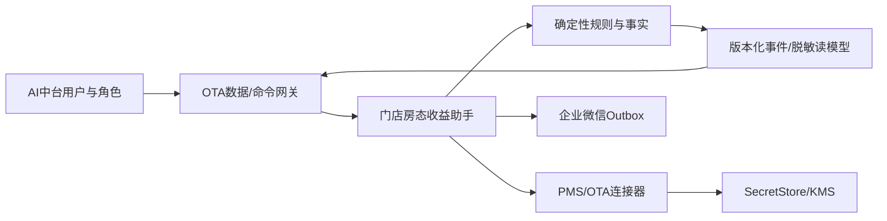
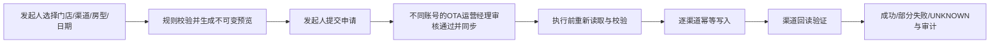

# 四方馆 AI 中台“门店房态收益助手”实施准备设计

文档版本：`V1.0`

形成日期：2026-08-11

状态：`DESIGN FROZEN / IMPLEMENTATION READY / NO PRODUCTION WRITE AUTHORIZATION`

适用范围：四方馆 AI 中台与现有 OTA 云端服务的融合、全门店只读 UAT，以及后续受控调价能力。

关联文档：

- `OTA-AUTOMATION-V0.1-DESIGN-DISCUSSION.md`
- `OTA-AUTOMATION-V0.1-TECH-DESIGN.md`
- `OTA-AUTOMATION-V0.1-CODING-READINESS.md`
- `OTA-AUTOMATION-V0.1-CONTROLLED-EXTERNAL-INTAKE-WORK-PACKAGE.md`
- `OTA-ALERT-NOTIFICATION-POLICY.md`
- `HOTEL-AI-OS-OTA-INTEGRATION-V1.0-WP0-READINESS.md`
- `HOTEL-AI-OS-OTA-INTEGRATION-V1.0-WP1-IMPLEMENTATION-REPORT.md`

---

## 1. 文档目的与实施边界

本文把已经逐板块确认的产品、权限、数据、安全、AI、预警、调价、留存和 UAT 规则汇总为一个实施准备包，并给出候选数据库变更、API/事件契约和分阶段工作包。

本文不是数据库迁移脚本、生产部署指令或外部渠道写入授权。形成本文期间及本文确认后，在另行下达实施授权前：

1. 不修改业务代码、数据库、UI、运行配置或生产数据。
2. 不访问或写入任何 PMS、OTA、企业微信生产接口。
3. 不接收、保存或展示真实账号、密码、Cookie、Token、Webhook、验证码或住客信息。
4. 不以页面可见、HTTP 成功、模拟测试或文档完备替代厂商授权、UAT 和生产验收。
5. 所有数据库版本号、表名和接口路径均为候选实施基线；编码前须与仓库当前状态和部署数据库再次核对。

## 2. 已冻结的产品与架构决策

### 2.1 产品定位

现有 OTA 云端服务以“门店房态收益助手”身份融入四方馆 AI 中台，成为 OTA 经营板块的一个能力域，覆盖：

- PMS 与 OTA 多渠道接入、标准化和健康监控。
- 今日经营、远期房态、平台流量、订单、销售额、竞对和违规异常。
- 确定性 P1/P2/P3 预警、任务、站内通知与企业微信通知。
- 受控 AI 解释、建议、摘要和人工分析。
- 经正式写入授权和 UAT 的渠道受控调价。

### 2.2 独立领域服务边界

OTA 服务继续作为独立有界上下文和独立运行单元：

- PMS/OTA 连接器、原始来源处理、标准化、确定性规则、简报、预警和渠道写入均由 OTA 服务负责。
- AI 中台通过版本化 API 和领域事件调用 OTA 服务，不直接读取 OTA 数据库，不共享数据库账号，不直接解析 Secret。
- AI 中台不可用时，不得阻塞 OTA 服务的采集、规则计算、简报和既有安全通知。
- 迁移期保留现有云端服务；新链路先只读并行，通过门店级 UAT 后逐店切换。



### 2.3 单一事实源和单一写入方

- 门店、组织和任职范围以 AI 中台 IAM/组织目录为事实源。
- 渠道绑定、来源健康、指标、预警、简报和调价执行以 OTA 服务为事实源。
- Secret 本体仅由 SecretStore/KMS 保存；业务数据库只保存不透明 `secret_ref` 和安全指纹。
- 每类业务事实只有一个权威写入方；跨服务通过 API/事件投影，不做跨库双写。

## 3. 角色权限矩阵

组织当前没有“收益经理”岗位，不新增虚拟岗位。收益规则、调价审核和 OTA 策略归 OTA 运营经理负责。

| 能力 | OTA运营经理 | OTA运营助理 | 店长/店助/前厅主管 | 区域经理 | CEO/管理层 | 平台管理员 |
|---|---|---|---|---|---|---|
| 查看授权门店指标、预警、任务 | 全部授权范围 | 授权门店 | 本门店 | 管辖区域 | 集团只读 | 技术排障所需最小范围 |
| 配置收益规则/预警阈值 | 负责，版本化审计 | 无 | 无 | 复核只读 | 只读 | 仅技术配置，不改经营口径 |
| 配置门店 AI 场景开关 | 负责 | 无 | 无 | 只读 | 只读 | 可按授权维护技术配置 |
| 发起调价预览/申请 | 可 | 可 | 可，仅本门店 | 无 | 无 | 无 |
| 超出建议价格区间 | 可预览，仍需合规审核 | 不得提交 | 不得提交 | 无 | 无 | 无 |
| 审核并同步标准零售价 | 负责 | 无 | 无 | 复核只读 | 只读 | 无 |
| 录入/更新凭据 | 可 | 无 | 无 | 无 | 无 | 可 |
| 查看/导出明文凭据 | 禁止 | 禁止 | 禁止 | 禁止 | 禁止 | 禁止 |

调价职责分离规则：

1. 发起人与审核人必须是不同账号。
2. OTA 运营经理发起的申请，必须由另一名 OTA 运营经理审核。
3. 审核操作统一为“审核通过并同步”，但后台仍须分别记录批准、执行、渠道回读三个阶段。
4. 任何角色均不能绕过建议区间、门店范围、渠道授权、UAT 状态或执行前校验直接写渠道。

## 4. 数据交换契约

### 4.1 AI 中台向 OTA 服务

仅传输完成业务动作所需的最小信息：

- 认证主体、角色、租户和门店授权范围。
- 查询条件、指标周期和数据新鲜度要求。
- AI 人工分析请求和允许的场景。
- 调价预览请求、调价申请、审核命令和处置说明。
- `idempotencyKey`、`correlationId`、`expectedVersion` 和调用时间。

不得传输或缓存 PMS/OTA 明文凭据、Cookie、Token、Webhook 或住客信息。

### 4.2 OTA 服务向 AI 中台

- 标准化经营事实和指标，以及来源、截止时间、完整性和质量状态。
- 门店×PMS/OTA 来源健康、最近成功采集、会话状态和待处置原因。
- P1/P2/P3 预警、证据、任务状态、站内/企业微信投递状态。
- AI 建议、所用模型/提示词版本、数据截止时间和确定性回退状态。
- 调价预览、审批、逐渠道执行、回读验证和人工处置状态。
- UAT 运行、门店级证据包、签署和发布状态。

### 4.3 通用 Envelope

所有 API 响应和领域事件至少包含：

```json
{
  "schemaVersion": "1.0",
  "eventId": "opaque-id",
  "tenantId": "opaque-id",
  "storeId": "stable-id",
  "occurredAt": "server-time",
  "businessDate": "YYYY-MM-DD",
  "sourceCutoffAt": "server-time",
  "qualityStatus": "COMPLETE|PARTIAL|STALE|PENDING_VERIFICATION",
  "correlationId": "opaque-id",
  "payload": {}
}
```

`qualityStatus` 非 `COMPLETE` 时，不得用零填充缺失指标，也不得形成无证据的经营结论。

## 5. 门店、来源、凭据和授权模型

### 5.1 绑定粒度

每个门店分别建立：

- 门店与 PMS 实例绑定。
- 门店与每个 OTA 渠道及渠道酒店 ID 绑定。
- 房型、价型、日期和渠道产品映射版本。
- 只读权限、写入权限、授权文件、UAT 和生效状态。

默认每个门店使用独立凭据。集团凭据仅可在厂商明确支持且授权文件列明门店范围时复用；失效时必须列出全部受影响门店。

### 5.2 SecretStore/KMS

SecretStore/KMS 未来保存所有门店的 PMS/OTA 地址、账号、密码、Cookie、Token/API Key 等秘密，但遵守以下边界：

1. AI 中台其他功能只能通过数据/命令网关读取标准化数据或调用经授权能力，不能读取原始 Secret。
2. 仅连接器服务身份可在单门店、单渠道、单任务、短生命周期上下文中解析一个 `secret_ref`。
3. Secret 不进入 API 响应、事件、URL、日志、通知、审计正文、导出文件或模型上下文。
4. 录入和更新使用独立安全通道；平台管理员和 OTA 运营经理可写入，但均不可回显或导出明文。
5. 轮换、失败、撤销和解析均留存不含秘密的审计事件。

### 5.3 保存不等于启用

新绑定依次通过：格式校验 → 只读连通性 → 字段/房型映射 → 人工金标准比对 → UAT → 门店级启用。写入授权和只读授权分离，未通过写入 UAT 的渠道只能预览。

## 6. 经营总览与 OTA 平台预警

首页采用“异常与待办优先于经营指标”的布局：

1. P1/P2 异常、超时任务、来源失效和调价未知结果。
2. OTA 平台预警，包括流量、转化、订单、销售额、竞对、价格竞争力、违规和下线风险。
3. 今日经营、远期房态、门店/区域/集团趋势和数据新鲜度。
4. P3 观察项和每日摘要。

### 6.1 初始量化指标

| 类别 | 指标 | 初始判断方式 |
|---|---|---|
| 流量 | 曝光、访问、搜索排名 | 与门店同星期基线、渠道大盘和竞对变化比较 |
| 转化 | 访问转化率、预订转化率 | 相对基线下降且样本量达到门槛 |
| 订单 | 新增、取消、净订单、小时进单 | 与历史节奏、昨日和同商圈比较 |
| 销售额 | GMV、房费、ADR、RevPAR | 绝对差异与相对差异并行 |
| 竞对 | 价格、房态、排名、三项前30% | 每渠道独立判断，缺失为待核验 |
| 合规 | 违规、下线、限流、产品不可售 | 平台事实优先，不由 AI 猜测 |

初始模板由集团提供。OTA 运营经理可按门店×渠道调整，但每次调整必须记录版本、适用范围、原因、生效时间和操作者。

### 6.2 证据与关闭

- 每条预警必须显示来源、指标窗口、基线窗口、截止时间、数据质量和证据编号。
- 严重度由确定性规则生成；AI 不得升降级。
- 预警可分派、确认、处置、复核和关闭；关闭必须有新采集事实或人工复核证据。
- 外部后台仅允许跳转到预先批准的 HTTPS 域名和固定路径；URL 不含凭据、Cookie、住客信息或可重放授权。

## 7. P1/P2/P3 通知与任务

以 `OTA-ALERT-NOTIFICATION-POLICY.md` 为详细规则，冻结摘要如下：

| 级别 | 正式任务 | 站内通知 | 企业微信 | 超时 |
|---|---|---|---|---|
| P1 | 立即创建 | 立即 | 首次立即通知 | 按既有 SLA 升级 |
| P2 | 立即创建 | 立即 | 首次立即通知 | 仍升级至 OTA 运营经理 |
| P3 | 不创建 | 首页观察 | 每日摘要一次 | 不升级 |

补充规则：

- 调价部分失败或结果 `UNKNOWN` 为 P1。
- 幂等键至少包含门店、渠道、预警类型、事实发生批次和通知阶段。
- P2 首次通知与超时升级是不同幂等阶段。
- 通知只包含脱敏指标、证据编号和安全处置入口。

## 8. AI 治理与门店级开关

### 8.1 职责边界

确定性规则负责事实、指标、严重度、任务创建、SLA、升级和幂等。大模型仅可：

- 解释已确认事实。
- 给出可能原因，并区分“已确认”与“待核验”。
- 提议行动、责任岗位、完成时限、预期结果和复查指标。
- 生成人工可读简报、P3 每日摘要和复盘草稿。

大模型不得修改事实、严重度、负责人、截止时间、任务状态、房价、库存或渠道状态。

### 8.2 门店级配置

后台按门店分别勾选：

- 计划简报 AI 建议。
- P1 AI 解释。
- P2 AI 解释。
- P3 每日摘要自动企业微信推送。
- 人工调用 AI 分析。

新门店默认全部关闭。只有 OTA 运营经理或平台管理员可启用；变更按下一计算周期生效，并记录版本和审计。P3 每日摘要按门店×营业日最多一次。

### 8.3 模型网关

- 模型提供方、API Key、允许模型、提示词模板和集团预算由平台管理员在集团模型网关配置。
- 门店只配置场景开关、预算上限和调用频率，不持有模型密钥。
- 模型上下文只接收脱敏、最小、结构化经营事实。
- 规则生成正式任务；AI 只能附加建议，或由授权人员将建议转为任务草稿。

### 8.4 输出和质量门禁

输出结构必须包含：结论、证据与截止时间、已确认/待核验原因、行动与优先级、责任岗位与期限、预期结果与复查指标、数据缺口和置信说明。

上线门禁：

- 数字一致性 100%。
- Secret/住客信息泄露 0。
- 越权动作 0。
- 结构化输出成功率不低于 99%。
- 有证据支撑的结论不低于 98%。
- 模型不可用时确定性回退 100%。
- OTA 运营经理抽检“可执行”比例不低于 80%。

模型、提示词或知识库版本变化必须先做离线回归，再做 UAT。

## 9. 受控调价设计

### 9.1 首期范围

仅对已取得正式写入授权且通过写入 UAT 的渠道开放。首期只修改指定门店、指定房型、指定日期的标准零售价；其他价型只读预览。

### 9.2 流程



### 9.3 不可变预览

预览至少冻结：

- `previewId`、有效期和生成时间。
- 门店、渠道、酒店、房型、价型和日期映射版本。
- 当前价格、建议区间、拟定价格、规则版本和计算证据。
- 授权版本、来源新鲜度和价格指纹。

预览过期、映射变化、当前价格变化、授权/UAT 失效或来源过期时必须重新预览。

### 9.4 执行安全

1. 审批前验证不同账号和门店范围。
2. 执行前重新读取当前渠道价格、渠道状态、授权、UAT、映射和规则版本。
3. 每个渠道写入使用唯一幂等键；结果按渠道分别记录。
4. 超时且无法证明成功时标记 `UNKNOWN`，禁止盲目重试并创建 P1 人工处置。
5. 写入后必须回读；仅请求成功但回读不一致不得记为成功。
6. 回滚不是删除历史或覆盖审计，而是基于已知价格生成一张新的受控申请。

## 10. 数据治理、留存和恢复

### 10.1 数据域

- SecretStore：秘密、轮换元数据和最小访问审计。
- 脱敏经营数据仓：标准化事实、指标、简报、AI 建议、预警、任务和调价读模型。
- 追加式审计域：权限、配置、规则版本、审批、执行、回读、UAT 和人工修正事件。

### 10.2 留存期限

| 数据 | 总保留期限 | 到期动作 |
|---|---:|---|
| 标准化经营事实和指标 | 1年 | 到期删除，不转冷归档 |
| 简报、AI建议、预警、任务、调价及普通审计 | 1年 | 到期删除，不转冷归档 |
| 脱敏原始来源响应 | 30天 | 到期删除 |
| 运行和错误日志 | 180天 | 到期删除 |

法律、调查或专项审计保全可暂停删除；保全必须有范围、原因、批准人和解除时间。不得长期保存原始住客个人信息。

### 10.3 备份恢复

- 数据库 PITR 7 天。
- 每日加密全量备份 30 天。
- 每月加密备份 12 个月，到期销毁。
- 备份存放在服务器之外的对象存储；SecretStore 备份与数据备份分离，密钥与密文分离。
- 每季度恢复演练；目标 `RPO <= 15分钟`、`RTO <= 4小时`。
- 备份失败产生 P1 并通知平台管理员。

## 11. 全门店 UAT 与逐店发布

### 11.1 范围和运行方式

当前 OTA 后台已配置的全部门店都参加，不采用两店抽样。UAT 连续运行 7 个 PMS 营业日：

- 以门店×PMS×OTA 渠道为最小验收单元。
- 保持只读并行，现有云端服务继续工作。
- 采集错峰、限流，不对 PMS/OTA 形成突发流量。
- 企业微信只投递到 UAT 测试范围，不发正式经营群。
- 只读 UAT 期间不调用任何 OTA 写入。
- 门店通过后可逐店发布；未通过门店继续使用原服务。

### 11.2 验收门禁

每店独立形成证据包并由 OTA 运营经理签署，至少满足：

- 计划采集成功率不低于 99%，关键窗口无缺失。
- 房费核对到分；库存、新增、取消和净间夜与金标准一致。
- P1/P2 零漏告，重复预警和重复通知为 0。
- UAT 计划消息生成与测试投递为 100%。
- AI 数字一致性 100%，不可用时确定性回退有效。
- 跨门店越权、Secret 泄露和住客信息泄露为 0。
- 无阻断缺陷；恢复、补采、重复消息抑制和发布回退演练通过。

失败项必须标记 `待核验` 或失败原因，不得以人工填零或忽略门店的方式提高通过率。

## 12. 候选数据库变更清单

当前核对基线：AI 中台主迁移最新为 `V24__wecom_group_robot_store_webhooks.sql`，OTA 独立迁移最新为 `V6__sprint2d_offline_manual_authorization_rehearsal.sql`。下表只用于排期，实施前须再次读取实际数据库历史，禁止直接复制版本号上线。

### 12.1 候选迁移包

| 候选版本 | 目标 | 主要对象 |
|---|---|---|
| V25 | 门店、来源、Secret引用和授权 | `ota_integration_store`、`ota_source_binding`、`ota_secret_binding`、`ota_source_authorization`、`ota_source_health` |
| V26 | 标准事实、指标和新鲜度 | `ota_fact_batch`、`ota_metric_snapshot`、`ota_data_quality_event`、房型/渠道映射版本 |
| V27 | 预警、任务关联和投递 | `ota_alert_policy_version`、`ota_alert_event`、`ota_alert_occurrence`、`ota_task_link`、`ota_delivery_event` |
| V28 | AI门店策略和生成审计 | `ota_ai_store_policy_version`、`ota_ai_generation`、`ota_ai_evaluation` |
| V29 | 调价预览、申请、执行和回读 | `ota_reprice_preview`、`ota_reprice_request`、`ota_reprice_channel_execution`、`ota_reprice_readback` |
| V30 | UAT、逐店发布、留存与保全 | `ota_uat_run`、`ota_uat_evidence`、`ota_store_release`、`data_retention_policy_version`、`data_legal_hold` |

### 12.2 数据库硬约束

- 所有经营表包含 `tenant_id`，门店表使用稳定 `store_id`；RLS 与服务账号最小授权必须实测。
- `secret_binding` 只允许 `secret_ref`、用途、版本、安全指纹和状态，不得保存秘密正文。
- 预警、审批、执行、回读、投递和审计事件追加写；更正通过新事件和 `supersedes_id`，不原地改历史。
- 唯一约束覆盖采集批次、消息阶段、AI 每日摘要和渠道写入幂等键。
- 调价执行、AI 生成和 UAT 证据必须引用当时的规则、映射、授权、模型或提示词版本。
- 删除任务按留存策略执行并写最小不可逆删除证明；处于保全范围的数据跳过删除。
- 不建立住客姓名、电话、订单备注、明文账号密码、Cookie、Token 或 Webhook 字段。

### 12.3 与既有模块的关系

- 正式任务继续复用 AI 中台任务中心；`ota_task_link` 只保存 OTA 预警与中台任务 ID 的映射和同步状态。
- 站内通知和企业微信复用既有通知/Outbox 能力，不另建直接发送旁路。
- 组织、岗位和门店授权范围复用 IAM/组织服务，不在 OTA 库复制可编辑的权限事实源。

## 13. 候选 API 契约

统一前缀：`/api/v1/ota-assistant`

### 13.1 查询与配置

| 方法 | 路径 | 用途 |
|---|---|---|
| GET | `/stores` | 按授权范围查询门店及总体健康 |
| GET | `/stores/{storeId}` | 查询门店详情、来源绑定和数据新鲜度 |
| GET | `/stores/{storeId}/bindings` | 查询 PMS/OTA 绑定、授权、UAT 和健康 |
| POST | `/stores/{storeId}/bindings` | 创建绑定草稿；仅接收不透明 `secretRef` |
| POST | `/stores/{storeId}/bindings/{bindingId}/validate` | 触发受控只读校验 |
| GET | `/dashboard` | 异常优先总览 |
| GET | `/metrics` | 标准化经营指标和质量状态 |
| GET | `/alerts` | 预警和证据查询 |
| POST | `/alerts/{alertId}/acknowledge` | 确认接收 |
| POST | `/alerts/{alertId}/handling-notes` | 追加处置说明 |

### 13.2 AI

| 方法 | 路径 | 用途 |
|---|---|---|
| GET | `/stores/{storeId}/ai-policy` | 查询门店 AI 开关和版本 |
| PUT | `/stores/{storeId}/ai-policy` | 以 `expectedVersion` 更新门店策略 |
| POST | `/stores/{storeId}/ai-analysis` | 在授权场景中人工调用分析 |

### 13.3 调价

| 方法 | 路径 | 用途 |
|---|---|---|
| POST | `/price-previews` | 生成不可变预览 |
| POST | `/price-requests` | 从有效预览提交申请 |
| POST | `/price-requests/{requestId}/approve-and-sync` | 不同账号审核并触发受控同步 |
| GET | `/price-requests/{requestId}` | 查询审批、逐渠道执行和回读 |
| POST | `/price-requests/{requestId}/manual-disposition` | 记录 UNKNOWN/失败的人工处置 |

### 13.4 UAT 与发布

| 方法 | 路径 | 用途 |
|---|---|---|
| GET | `/uat/runs` | 查询全门店 UAT 运行和覆盖率 |
| GET | `/uat/runs/{runId}/stores/{storeId}` | 查询门店证据包 |
| POST | `/uat/runs/{runId}/stores/{storeId}/sign-off` | OTA 运营经理签署证据包 |
| GET | `/releases/stores` | 查询逐店发布状态和阻断原因 |

### 13.5 命令要求和错误语义

所有写命令必须从认证上下文确定租户和角色，并携带：

- `Idempotency-Key`
- `X-Correlation-Id`
- 资源版本 `expectedVersion`
- 客户端时间只用于诊断，权威时间使用服务器时间

统一错误至少区分：`FORBIDDEN_SCOPE`、`VERSION_CONFLICT`、`PREVIEW_EXPIRED`、`SOURCE_STALE`、`AUTHORIZATION_MISSING`、`UAT_NOT_PASSED`、`MAPPING_CHANGED`、`CHANNEL_REJECTED`、`EXECUTION_UNKNOWN`。`EXECUTION_UNKNOWN` 不能映射成普通可重试 5xx。

### 13.6 领域事件

候选事件：

- `ota.metric.snapshot.v1`
- `ota.source.health.changed.v1`
- `ota.alert.opened.v1`、`ota.alert.updated.v1`、`ota.alert.resolved.v1`
- `ota.delivery.planned.v1`、`ota.delivery.completed.v1`、`ota.delivery.failed.v1`
- `ota.ai.generated.v1`、`ota.ai.fallback.used.v1`
- `ota.reprice.requested.v1`、`ota.reprice.approved.v1`、`ota.reprice.executed.v1`、`ota.reprice.readback.v1`
- `ota.uat.store.status.changed.v1`

事件使用 Outbox、至少一次投递和消费幂等；消费者不得依赖数据库事务内双写。

## 14. 分阶段实施工作包

### WP0：设计基线与工程门禁

交付：冻结 ADR、仓库/部署/数据库现状核对、数据字典、威胁模型、SecretStore 与模型网关选型记录。

门禁：范围、所有者、授权材料、真实数据禁入测试夹具和回滚计划明确。

### WP1：身份、租户、SecretStore 和数据网关

交付：SSO/权限适配、门店范围、Secret 引用、安全录入通道、服务身份、API 网关和审计。

门禁：跨门店越权 0、Secret 回显/日志泄露 0、RLS 和服务账号最小授权通过。

### WP2：门店 PMS/OTA 配置与凭据迁移

交付：门店×来源绑定、映射、授权状态、加密迁移工具和只读校验流程。

门禁：真实凭据只在授权安全通道迁移；旧环境撤销和受影响门店清单可验证。

### WP3：只读同步、1 年经营数据和数据质量

交付：版本化连接器、采集水位、标准事实、指标、新鲜度、30 天脱敏原始证据和留存任务。

门禁：金标准核对、断点续跑、限流、重复抑制和来源不可用状态通过。

### WP4：异常优先首页和经营读模型

交付：P1/P2 待办、OTA 平台预警、今日/远期指标、证据和安全深链。

门禁：缺失数据不显示为零，权限范围、阈值版本和证据截止时间正确。

### WP5：预警、任务、站内和企业微信

交付：P1/P2/P3 路由、任务中心映射、Outbox、P2 首次通知、超时升级和 P3 每日摘要。

门禁：P1/P2 零漏告、重复 0、消息脱敏 100%，仅 UAT 通道测试。

### WP6：模型网关、门店 AI 开关和质量评测

交付：集团模型配置、门店策略、结构化提示词、确定性回退、离线评测和版本审计。

门禁：达到第 8.4 节质量门槛，模型不可用不影响事实、预警、任务和简报。

### WP7：受控标准零售价写入

交付：预览、申请、不同账号审核、执行前校验、幂等写入、回读、UNKNOWN 人工处置和审计。

门禁：仅授权且写入 UAT 通过渠道；不得扩大至其他价型、库存、开关房或促销。

### WP8：全部门店 7 日 UAT 与逐店发布

交付：覆盖矩阵、每日证据、缺陷清单、门店签署、逐店启用和回退演练。

门禁：第 11.2 节全部通过；失败门店留在原服务，不阻塞已通过门店。

## 15. 实施顺序

冻结顺序如下，不并行越过安全底座：

1. 认证、租户、SecretStore 和数据网关。
2. 门店 PMS/OTA 配置和凭据迁移。
3. 只读同步、1 年历史经营数据和首页。
4. 预警、任务、站内通知和企业微信。
5. 模型网关、门店 AI 开关和评测。
6. 受控价格写入最后实施。

## 16. 编码前仍需落实的外部前置

以下不是产品设计悬项，但会阻断对应阶段：

1. 当前全部门店、PMS、OTA 渠道、酒店 ID、绑定和健康状态的脱敏清单。
2. 各 PMS/OTA 厂商的正式只读/写入授权、允许方法、频率和门店范围。
3. SecretStore/KMS 和模型提供方的采购/合规选型及成本上限。
4. 企业微信 UAT 接收范围，不使用正式经营群做开发测试。
5. 各门店人工金标准、房型/价型映射负责人和 OTA 运营经理签署人。
6. 仅在 WP7 前提供已获授权渠道的写入 UAT 环境；此前不需要任何写入凭据。

上述资料必须通过受控后台或安全交付渠道提供；不得把真实秘密发送到聊天、设计文档或代码仓库。

## 17. 完成定义

本文完成表示十个设计板块已形成一致的实施基线，数据库变更、API/事件和工作包已可进入技术评审。它不表示已执行迁移、已完成连接器、已接入真实凭据、已通过全门店 UAT 或已获生产/OTA 写入授权。
