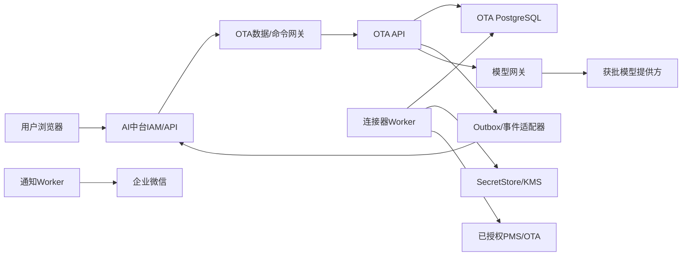

# 四方馆 AI 中台“门店房态收益助手”WP0 实施基线与工程门禁

文档版本：`WP0-1.0`

形成日期：2026-08-11

状态：`WP0 COMPLETE / WP1 OFFLINE FOUNDATION CONDITIONAL GO / REAL INTEGRATION NO-GO`

上位设计：`HOTEL-AI-OS-OTA-INTEGRATION-V1.0-IMPLEMENTATION-READINESS.md`

后续实施：`HOTEL-AI-OS-OTA-INTEGRATION-V1.0-WP1-IMPLEMENTATION-REPORT.md`

---

## 1. WP0 结论

WP0 已形成可审计的实施起点，完成架构决定记录、现有工程基线、数据分类、信任边界、威胁模型、WP1 任务拆分和验证矩阵。

结论分为两层：

- **WP1 离线安全基础：条件准入。** 可以在不接触真实 Secret、不访问 PMS/OTA、不改生产环境的前提下，实施接口、权限、Secret 引用、假实现和自动化负向测试。
- **真实接入与凭据迁移：禁止。** SecretStore/KMS 产品、服务身份、授权清单、受控录入通道和 UAT 环境尚未验收，不能录入或迁移真实账号、密码、Cookie、Token 或 Webhook。

本报告没有修改数据库迁移、业务代码、UI、运行配置或生产数据。

## 2. 只读基线快照

检查时间：2026-08-11（Asia/Shanghai）

### 2.1 Git 与工作树

| 项目 | 快照 |
|---|---|
| 分支 | `codex/daily-operations-v1` |
| HEAD | `75a2c2915c8667f9dc4a32849e63e35b05b1df9c` |
| 相对远端 | ahead 26 |
| 已跟踪未提交差异 | 本次核对未发现 |
| 未跟踪文件 | 10,718 项，属于既有用户工作区和本任务新增文档 |

保护规则：不清理、不移动、不批量格式化、不自动暂存既有未跟踪文件；以后每个工作包只操作明确白名单路径，并在测试前后比较目标路径差异。

### 2.2 工程模块

已存在 OTA 独立运行模块：

- `apps/ota-standalone-api`
- `apps/ota-standalone-web`
- `apps/ota-connector-worker`
- `apps/ota-browser-session-helper`
- `packages/ota-contracts`
- `database/ota-migrations`

已存在 AI 中台相关基础模块：IAM、组织、规则、任务、通知、企业微信、审计、事件、幂等、经营指标和驾驶舱。

`packages/ota-contracts` 已存在：

- 框架无关的连接器、采集、质量、记录和事件契约。
- `IdentityProviderPort`、`SecretStorePort`、`AiAdvicePort`、`TaskProjectionPort`、`MessageDeliveryPort`、`PlatformEventPublisherPort` 等边界。
- OpenAPI 与 JSON Schema 基础资产及契约测试。

这些资产是复用起点，不代表已实现本期 AI 中台数据网关、正式 SecretStore、统一 SSO、门店 AI 策略或受控调价。

### 2.3 数据库迁移基线

| 数据库 | 当前仓库最新迁移 | 说明 |
|---|---|---|
| AI 中台主库 | `V24__wecom_group_robot_store_webhooks.sql` | 主库迁移集，不与 OTA 迁移混用 |
| OTA 独立库 | `V6__sprint2d_offline_manual_authorization_rehearsal.sql` | 当前仍是离线授权演练边界 |

实施规则：后续候选 V25+ 仅在再次核对真实 Flyway 历史、备份、所有权和运行账号后确定；本 WP0 不创建 SQL 文件。

### 2.4 本地运行状态

只读状态脚本在本次检查中返回：Core API、HTTP/HTTPS 监听、PostgreSQL 监听和隧道均未运行，对应 Windows 服务为停止/禁用或任务未安装。

该结果仅说明当前本机检查时点没有活动 Pilot 运行时，不等于代码故障或云端服务状态。WP0 不启动、重启或修复任何服务；WP1 需要运行验证时应另起隔离的离线测试环境。

## 3. 架构决定记录（ADR）

### ADR-WP0-001：独立有界上下文

**决定**：门店房态收益助手保留独立部署、独立数据库和独立发布节奏；AI 中台通过版本化 API/事件接入。

**理由**：避免中台故障阻断采集和简报，避免跨库耦合和凭据扩散。

**禁止**：直接跨库查询、共享数据库运行账号、业务事务双写、AI 中台直接调用 PMS/OTA。

### ADR-WP0-002：身份和授权由服务端解析

**决定**：组织、账号、岗位、门店范围来自 AI 中台 IAM；OTA 服务使用稳定账号映射和授权版本，所有范围在服务端校验。

**禁止**：相信前端自报角色、租户或门店列表；使用显示名称作为权限主键；以隐藏按钮代替服务端授权。

### ADR-WP0-003：Secret 本体不进入 AI 中台业务域

**决定**：SecretStore/KMS 是唯一秘密事实源。业务数据库和 API 只使用不透明 `secret_ref`；连接器通过短生命周期租约在单门店、单渠道、单任务上下文中使用 Secret。

**现有基础**：`SecretStorePort` 已采用回调式 `SecretLease`，Secret DTO 不含值。

**后续要求**：WP1 增加用途限制、服务身份、租约期限、并发限制、解析审计和失败关闭，但不引入真实 Secret。

### ADR-WP0-004：确定性规则是经营事实权威

**决定**：指标、严重度、任务、SLA、升级和幂等由确定性规则负责；大模型只解释、建议和总结。

**禁止**：模型修改事实、严重度、任务状态、负责人、截止时间、价格、库存或渠道状态。

### ADR-WP0-005：单一写入方与追加式证据

**决定**：每类事实只有一个权威写入方。预警、投递、AI、审批、执行、回读和 UAT 使用追加式事件；更正写新版本，不覆盖历史。

**通信**：本地事务使用 Outbox，跨服务至少一次投递，消费者按事件/业务幂等键去重。

### ADR-WP0-006：受控调价最后开放

**决定**：只读数据链路、预警、通知、AI 和全门店 UAT 完成后，才实现已正式授权渠道的标准零售价写入。

**禁止**：WP1-WP6 调用任何 OTA 写接口；用网页操作成功、HTTP 200 或模拟结果替代正式写入授权和回读验收。

### ADR-WP0-007：前向迁移与逐店发布

**决定**：数据库只做前向兼容迁移；上线按门店逐店启用，失败门店留在原服务。

**禁止**：破坏性 Down Migration、一次切换全部门店、以整体平均掩盖单店失败。

### ADR-WP0-008：留存和恢复

**决定**：标准经营事实、指标、简报、AI 建议、预警、任务、调价和普通审计总保留 1 年；脱敏原始响应 30 天，运行/错误日志 180 天。法律保全优先。

**恢复目标**：`RPO <= 15分钟`、`RTO <= 4小时`；SecretStore 备份和密钥独立于业务数据备份。

## 4. 信任边界与服务身份

### 4.1 身份最小权限

| 身份 | 允许 | 禁止 |
|---|---|---|
| AI中台用户会话 | 调用授权门店的网关能力 | 直接访问 OTA 数据库或 SecretStore |
| OTA API | 授权、读模型、命令编排、追加审计 | 解析连接器 Secret、直接写外部渠道 |
| 连接器 Worker | 领取单租户任务、短租约解析单一 Secret、调用获批主机 | 人员认证、集团跨租户查询、任意 Secret 枚举 |
| 通知 Worker | 消费获批 Outbox、向获批接收范围发送 | 读取 Secret 正文或住客信息 |
| AI Gateway | 接收脱敏事实、执行允许模型 | 访问 PMS/OTA 凭据、生成正式经营事实 |
| Migration Owner | 执行受审迁移和授权脚本 | 作为应用日常运行身份 |
| Audit Reader | 读取脱敏审计视图 | 修改审计或读取 Secret |

## 5. 数据分类与处理规则

### 5.1 分类

| 等级 | 数据示例 | 允许存储位置 | 允许进入模型 | 允许进入企业微信 |
|---|---|---|---|---|
| C0 公开 | 公开渠道名称、公开政策 | 文档/业务库 | 按需 | 按需 |
| C1 内部 | 门店稳定 ID、规则版本、UAT 状态 | 业务库/审计 | 最小化 | 可脱敏 |
| C2 经营机密 | 房态、价格、收入、转化、竞对指标 | 脱敏经营仓 | 经场景授权的最小事实 | 仅必要摘要 |
| C3 Secret | 账号、密码、Cookie、Token、API Key、Webhook | SecretStore/KMS | 禁止 | 禁止 |
| C3 个人信息 | 姓名、电话、订单号、备注、住客明细 | 来源系统；非必要不落地 | 禁止 | 禁止 |

### 5.2 核心数据字典

| 概念 | 稳定键 | 权威来源 | 说明 |
|---|---|---|---|
| 租户 | `tenant_id` | AI 中台 IAM/组织 | RLS 硬边界 |
| 门店 | `store_id`/既有 `hotel_id` 映射 | AI 中台组织目录 | 名称可变，稳定 ID 不变 |
| 来源绑定 | `binding_id` | OTA 服务 | 门店×PMS/OTA 独立记录 |
| Secret 引用 | `secret_ref` | SecretStore 元数据投影 | 不透明，不可回显 |
| 授权 | `authorization_id + version` | OTA 服务 | 区分只读/写入、门店、方法、有效期 |
| 映射 | `mapping_id + version` | OTA 服务 | PMS 房型/价型到渠道产品 |
| 采集批次 | `collection_run_id` | OTA Worker | 有窗口、水位、质量和证据 |
| 指标快照 | `snapshot_id` | OTA 确定性计算 | 包含营业日、截止时间和质量 |
| 预警发生 | `occurrence_id` | OTA 规则引擎 | 严重度不可由 AI 改写 |
| 中台任务 | `task_id` | AI 中台任务中心 | OTA 仅保存关联和同步状态 |
| AI 生成 | `generation_id` | AI Gateway/OTA 编排 | 记录事实、模型、Prompt 和回退版本 |
| 调价申请 | `request_id` | OTA 服务 | 引用不可变预览和不同账号审批 |
| UAT 证据 | `evidence_id` | OTA UAT | 门店×来源×日期独立签署 |

## 6. 威胁模型与控制

| 威胁 | 影响 | 预防控制 | WP1 验证 |
|---|---|---|---|
| 客户端伪造租户/门店/角色 | 跨店越权 | 服务端 IAM 映射、授权版本、RLS | 错租户/错门店/错角色全部拒绝 |
| API 或日志泄露 Secret | 全门店账号风险 | DTO 禁值、`secret_ref`、日志脱敏、C3 扫描 | 序列化/异常/审计/日志负向测试 |
| 服务身份横向枚举 Secret | 批量凭据泄露 | 单任务租约、用途绑定、服务身份和门店范围 | 跨门店、跨渠道、错误用途解析失败 |
| 重放命令或事件 | 重复通知/重复写入 | 幂等键、请求哈希、版本冲突和 Outbox | 同键同载荷复用、同键异载荷拒绝 |
| 数据陈旧仍给经营结论 | 错误经营决策 | 截止时间、质量状态、基线门槛 | STALE/PARTIAL 不生成确定性结论 |
| Prompt 注入或模型越权 | 虚假建议/动作 | 结构化事实、工具白名单、输出校验、AI 只读 | 注入文本不能创建任务或命令 |
| 事件乱序/重复 | 状态回退或重复任务 | 聚合版本、因果/关联 ID、幂等消费 | 乱序拒绝或延迟，重复无副作用 |
| SSRF/任意深链 | 内网探测/凭据外泄 | 主机和路径白名单、禁 user-info/query Secret | 非 HTTPS、未知主机和动态凭据拒绝 |
| 批量采集冲击厂商 | 限流/封禁 | 错峰、速率限制、断路器和退避 | 并发及预算超限停止，不无限重试 |
| UNKNOWN 被盲目重试 | 重复调价 | UNKNOWN 独立状态、P1、人工处置 | 无回读证据时禁止自动重试 |
| 权限或规则被原地改写 | 无法追责 | 版本化配置、不同账号审批、追加审计 | 历史 UPDATE/DELETE 被拒绝 |
| 备份不可恢复 | 数据丢失 | 加密异地备份、季度恢复演练 | 恢复证据和 RPO/RTO 计时 |

## 7. WP1 实施边界

WP1 只建立认证、租户、SecretStore 和数据网关的离线安全基础。

### 7.1 允许范围

1. 在 `packages/ota-contracts` 增加向后兼容的 AI 中台网关契约、错误语义和 JSON Schema。
2. 建立 AI 中台身份到 OTA 稳定账号/角色/门店范围的适配接口和假实现。
3. 扩展 `SecretStorePort` 的用途、租约、解析审计和失败关闭契约；测试仅使用明显虚构材料。
4. 建立仅返回脱敏状态的 Secret 引用元数据模型。
5. 建立数据查询和命令网关的授权、幂等、版本和关联标识骨架。
6. 增加离线单元、契约、架构和敏感信息负向测试。

### 7.2 明确排除

- 不创建真实 SecretStore 账号、密钥或生产实例。
- 不录入、迁移、读取任何真实 PMS/OTA/企业微信凭据。
- 不访问 PMS、OTA、企业微信或模型提供方网络。
- 不创建真实渠道适配器，不启用现有真实连接开关。
- 不实现调价、库存、开关房或其他写入。
- 不变更生产数据库或启动本地/云端服务。

## 8. WP1 任务和验收矩阵

| 编号 | 任务 | 产物 | 通过条件 |
|---|---|---|---|
| WP1-01 | 契约兼容性基线 | API/事件版本规则与测试 | 既有契约测试不破坏，新旧版本可并存 |
| WP1-02 | 身份与角色映射 | `IdentityProviderPort` 适配契约 | 六类已确认岗位权限逐项通过/拒绝 |
| WP1-03 | 门店范围授权 | 服务端 Scope Guard | 客户端自报范围无效，跨店访问为 0 |
| WP1-04 | Secret 引用元数据 | 无 Secret DTO/状态模型 | 任意 API/事件/日志均无 Secret 值 |
| WP1-05 | 短租约解析契约 | 用途和服务身份约束 | 错用途、错门店、过期租约失败关闭 |
| WP1-06 | 查询/命令网关 | 幂等、版本、关联标识骨架 | 重放、冲突和越权测试通过 |
| WP1-07 | 审计事件 | 追加式脱敏事件 | 高权限成功无审计则事务失败 |
| WP1-08 | 安全自动化 | 架构/契约/敏感扫描 | 0 Secret、0 跨租户、0 未授权外联 |

### 8.1 WP1 完成门禁

- 所有新增能力默认关闭，假实现不得接受生产配置。
- 现有 OTA simulation-only、`message_enabled=false` 和外联阻断不被削弱。
- 运行身份保持 `NOBYPASSRLS`、非对象 Owner、无角色继承。
- API、Worker、Audit、Migration 身份不复用。
- 错租户、错门店、错角色、错用途和同键异载荷全部失败关闭。
- 敏感信息扫描无发现，代码和夹具没有真实门店凭据或住客信息。
- 新增契约有向后兼容说明和版本化测试。

## 9. 尚未选定但不阻塞 WP1 离线基础的事项

以下选择涉及合规、成本或生产运维，不在 WP0 擅自替用户决定：

1. 生产 SecretStore/KMS 具体产品、区域、密钥托管和灾备方案。
2. 大模型提供方、允许模型、预算上限和集团 API Key 管理方式。
3. AI 中台生产 IdP/OIDC issuer、客户端注册和账号合并流程。
4. 企业微信 UAT 接收范围和正式接收范围。
5. PMS/OTA 厂商正式授权清单、方法、频率和写入 UAT 环境。

WP1 应只依赖供应商中立的端口和虚构夹具；上述事项在接入对应生产适配器前必须单独确认。

## 10. WP0 完成定义

满足以下条件即视为 WP0 完成：

- 架构、数据、身份、Secret、AI 和写入边界已记录并与上位设计一致。
- 现有仓库、模块、迁移和运行状态已只读核对。
- 风险、控制、验证责任和 WP1 范围已明确。
- 未触碰既有未跟踪资产、真实凭据、外部系统或生产环境。

下一步是在上述边界内执行 WP1 离线安全基础；在生产 SecretStore 和授权资料验收前，真实接入仍保持 `NO-GO`。
