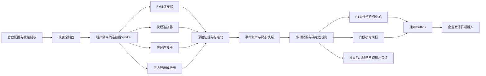
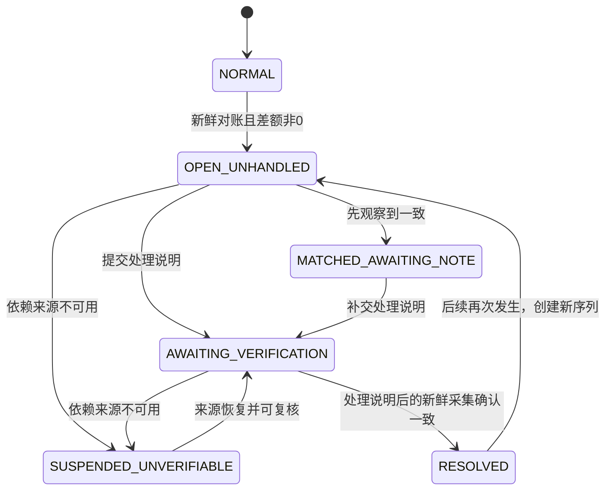

# OTA-AUTOMATION-V0.1 技术设计

任务编号：`OTA-AUTOMATION-V0.1`
文档版本：`TECH-DESIGN-1.0`
形成日期：2026-07-23
当前状态：T0至T5全部确认并冻结 / CONTROLLED EXTERNAL INTAKE OPEN / CONTROLLED LOGIN COMPLETE / OBSERVATION PARTIAL / COOKIE AUTOMATION BLOCKED / I1 VENDOR AUTHORIZATION REQUIRED / REAL CONNECTORS BLOCKED / PRODUCTION NO-GO
需求基线：`OTA-AUTOMATION-V0.1-DESIGN-DISCUSSION.md`（DESIGN-1.5）
试点门店：喷水池态六酒店、解放路MOOODSHIFT酒店

---

> 实施状态说明（2026-07-25）：Sprint 2C离线准入治理已完成。首个受控接入实例是“喷水池态六酒店＋PMS＋美团别样红系统”。门店授权人员已在独立Profile中完成一次人工认证和门店选择；受控刷新确认主页房态候选为无请求体POST，响应仅形成匿名结构指纹。原`lion/.../room`受控GET仅得到通用包络。官方协议复核后Cookie自动采集保持阻断，首选申请官方签名式OpenAPI；如OpenAPI不能覆盖冻结字段，网页会话自动化须先取得厂商书面许可并由独立浏览器会话代理托管。厂商许可、字段语义、频率、SecretStore和隔离运行仍未完成；隔离浏览器进程已关闭且不得复用其会话，真实适配器、自动抓取、企微投递和生产仍阻断。

## 一、文档用途与确认规则

本文把已经确认的产品需求转换为可实施的技术方案，覆盖架构、数据库、连接器、调度、水位、指标、P1状态机、企业微信投递、权限、测试和Sprint计划。

本文使用两种状态标记：

- **已确认**：来自DESIGN-1.5及后续明确确认，开发不得擅自改变。
- **外部资料待提供**：完成全部设计确认并取得开发授权后，不阻塞SPI、数据骨架和模拟链路；但阻塞真实连接器联调或UAT。

TECH-DESIGN-1.0中的推荐默认值均已在T0至T5收敛，当前不存在悬而未决的产品或技术决策。

执行规则：

1. T0至T5已按“一次只确认一个技术板块”的方式完成确认并冻结。
2. 技术板块T0至T5全部确认且产品负责人明确授权开发前，不创建应用骨架、数据库迁移、SPI、模拟连接器、测试夹具或任何业务代码。
3. Sprint 0从“全部技术设计确认＋明确开发授权”之后开始；设计讨论不与编码并行。
4. 业务数值、P1事实和简报状态必须由确定性规则生成；AI不得改写事实。
5. 需求文档与本文发生冲突时，先记录决策，不以开发人员个人判断覆盖产品口径。

## 二、开工门禁结论

### 2.1 可借鉴和迁移的底座

**已确认部署决策**：V0.1试点期间作为独立后台运行，拥有独立Web、API、数据库、连接器Worker、账号权限和发布周期，不依赖仍在开发的AI中台即可连续测试。后续通过稳定接口和事件契约融入AI中台。

现有AI中台代码已具备以下可借鉴或抽取的模式，但不是V0.1独立后台的运行时依赖：

- Java 21、Spring Boot、PostgreSQL、Flyway和React/Vite工程。
- `tenant_id`、组织树、角色、任职及PostgreSQL RLS。
- `outbox_event`、消费幂等、租约、重试和自动化Worker模式。
- `business_day_run`、不可变`daily_operation_snapshot`及指标质量状态。
- `management_task`、任务SLA、升级、通知和审计。
- `notification_delivery`表结构中的`WECHAT/WEBHOOK`通道、状态和租约字段；实际企微适配器及投递Worker尚未实现。
- AI请求、建议、来源和决策留痕。

现有AI中台基线验证结果为后端69项测试通过、0失败、2跳过，前端生产构建通过；该结果只证明可迁移模式的基线，不代表尚未建立的独立后台已经通过测试。

### 2.2 必须先解决的现状差距

1. 独立后台需要最小但完整的账号、角色、租户、门店、RLS和审计能力，不能依赖AI中台登录或组织服务。
2. 独立后台需要动态租户/门店作业目录，不能继承现有静态Worker租户ID列表。
3. 企业微信群需要正式群受众和投递Worker，不能通过虚构用户账号发送。
4. 小时槽位、修订、采集运行、水位、房型产品、订单间夜、P1事件和逐次投递证据需要在独立数据库中建立。
5. 必须先冻结身份、租户、任务、AI建议和事件的集成端口，避免后续融入AI中台时重写采集与规则。
6. 独立后台不得直接连接或写入AI中台开发数据库，也不得在试点期实行双写。

## 三、总体架构

### 3.1 双阶段逻辑架构

阶段A为当前确认的独立试点后台：



阶段B融入AI中台时，PMS/OTA采集、标准化、规则、P1和简报继续由OTA领域服务负责；AI中台通过SSO、导航、API和版本化领域事件接入，不直接读取OTA数据库。

### 3.2 部署单元

- `apps/ota-standalone-api`：独立控制面API、认证、配置、标准化、计算、P1、任务、简报、查询和审计。
- `apps/ota-standalone-web`：独立登录入口和四个OTA管理页面。
- `apps/ota-connector-worker`：独立部署进程，运行PMS/OTA适配器和受控浏览器；不与API共享浏览器进程。
- `packages/ota-contracts`：不依赖Spring、数据库或前端的API DTO、事件Envelope、枚举及JSON Schema，供未来AI中台适配器复用。
- `database/ota-migrations`：独立Flyway迁移集，不加载AI中台正在演进的迁移目录。
- 独立PostgreSQL实例/集群：配置、账号、标准数据、状态机、快照、任务、Outbox和审计；试点UAT及生产不得与AI中台共用数据库实例、维护窗口或资源配额。仅本地开发可共用服务器，但必须使用不同数据库和运行账号。
- SecretStore/KMS：Webhook、Cookie、Token、浏览器会话和数据库凭据。
- 加密对象存储：官方导出文件及必要的原始来源证据。

V0.1不引入外部消息中间件。任务领取、租约和Outbox使用独立PostgreSQL；以后规模增长时可替换传输实现，不改变领域契约。

物理代码可以暂时放在同一工作区，但必须独立构建、独立配置、独立部署且不编译依赖任何AI中台应用模块。达到稳定版本后可无代码改造地迁移到独立仓库。

### 3.3 模块边界

- `ota.controlplane`：集团账号、岗位、租户目录、门店生命周期和动态作业目录。
- `ota.admin`：租户、门店、连接器、Webhook及运行参数配置。
- `ota.secrets`：Secret引用、脱敏、轮换和授权状态。
- `ota.connector.spi`：统一连接器契约。
- `ota.connector.pms`、`ota.connector.ctrip`、`ota.connector.meituan`：具体适配器。
- `ota.ingestion`：调度、运行、原始证据、水位、重试和健康状态。
- `ota.normalization`：PMS营业日、房型、售卖产品、订单事件和间夜增量。
- `ota.analytics`：整点快照、房费、ADR、RevPAR、目标及节奏。
- `ota.reconciliation`：库存比较和P1状态机。
- `ota.briefing`：六段简报、修订、迟到数据和补记。
- `ota.delivery.wecom`：企业微信消息、全员提醒、重试和补发。
- `ota.readmodel`：单租户查询、跨租户只读扇出和覆盖状态。
- `ota.tasks`：P1任务、10分钟SLA、升级和采集复核关闭。
- `ota.audit`：配置、授权、导入、跨租户访问和投递证据。

连接器不得直接计算经营结论、创建任务、发送消息或修改PMS/OTA数据。

### 3.4 未来中台融合端口

独立后台从第一天通过端口隔离外部能力：

- `IdentityProviderPort`：当前使用独立账号；以后切换AI中台OIDC/SSO并关联同一稳定账号。
- `TenantDirectoryPort`：当前读取独立租户/门店目录；以后由AI中台组织主数据同步或查询。
- `TaskProjectionPort`：当前任务以独立`ota_task`为事实源；以后向AI中台任务中心发布只读投影。
- `AiAdvicePort`：当前可接独立AI提供方或规则回退；以后指向AI中台AI Gateway。
- `AuditSinkPort`：当前写独立审计；以后可同步脱敏审计事件到中台。
- `SecretStorePort`：隔离Secret Manager/KMS的具体实现。
- `MessageDeliveryPort`：生产阶段规划由独立后台直接投递企微；Sprint 1仅生成`BLOCKED`预览，后续可切换中台通知适配器。
- `PlatformEventPublisherPort`：通过本地Outbox发布版本化领域事件，中台不可用时不阻塞OTA主链路。

V0.1只实现独立后台适配器以及未来融合契约的测试桩；AI中台OIDC、任务投影、通知或事件消费者适配器属于后续独立集成模块，不进入V0.1构建和上线门禁。纯领域层不得依赖Spring Security Principal、JDBC表结构、AI中台内部Java类或Repository、企业微信HTTP客户端、某个IdP或SecretStore SDK。

### 3.5 数据归属与融合方式

1. 试点期间OTA独立数据库是唯一事实源，AI中台不得同时写同一OTA业务对象。
2. 每个租户、门店、账号、连接器、快照、事件、P1和简报使用稳定UUID。
3. 使用`external_reference`映射未来AI中台ID，不在试点期提前伪造或写入中台主键。
4. 对外领域事件统一包含`eventId`、`eventType`、`schemaVersion`、`sourceSystem`、`occurredAt`、`tenantRef`、`hotelRef`、`aggregateId`、`aggregateVersion`、`correlationId`、`causationId`和幂等键。
5. 后续优先采用“AI中台统一入口和SSO，OTA服务继续作为领域事实源”的融合方式；只有确需物理并库时才执行一次性迁移。
6. 物理迁移采用停写窗口、导出清单、行数/哈希核对、目标导入和切换，不采用长期双写。

## 四、连接器与后台配置

### 4.1 连接器SPI

```java
public interface SourceConnector {
    ConnectorDescriptor descriptor();
    ConfigValidationResult validateConfig(
        NonSecretConnectorConfig config,
        ConnectorCapabilityRequirement requirement
    );
    ConnectionTestResult testConnection(ConnectionContext context);
    AuthorizationProbeResult probeAuthorization(ConnectionContext context);
    CollectionResult collect(CollectionRequest request);
}

public interface InteractiveAuthorizationConnector {
    AuthorizationStartResult startAuthorization(AuthorizationContext context);
    AuthorizationProbeResult probeAuthorization(ConnectionContext context);
    void revokeAuthorization(ConnectionContext context);
}

public interface OfficialExportParser {
    ExportDescriptor descriptor();
    ExportValidationResult validate(ExportFileContext file);
    CollectionResult parse(ExportParseRequest request);
}
```

`CollectionRequest`必须包含：

- 租户、门店、连接器、配置版本和运行ID。
- 数据流类型及触发类型。
- 请求窗口`(fromExclusive, toInclusive]`。
- 已提交水位和PMS营业日上下文；无法确认时必须为空。
- 截止时间、超时、`trace_id`和`correlation_id`。

`CollectionResult`必须包含：

- `SUCCESS/PARTIAL/AUTH_REQUIRED/FAILED`。
- 标准记录、候选水位、来源有效时间、观察时间和原始证据引用。
- 完整性、分页、字段和能力校验结果。
- 结构化脱敏错误码，不返回Secret或消费者个人信息。

### 4.2 能力矩阵

适配器至少声明以下能力：

- `PMS_BUSINESS_DATE`
- `BOOKING_EVENTS`
- `CANCELLATION_EVENTS`
- `INVENTORY_BY_ROOM_TYPE`
- `INVENTORY_BY_SELL_PRODUCT`
- `ROOM_REVENUE_DETAIL`
- `ROOM_REVENUE_AGGREGATE`
- `HOURLY_ROOM_REVENUE`
- `OVERNIGHT_SOLD`
- `EFFECTIVE_SELLABLE_TOTAL`
- `SOURCE_UPDATED_AT`
- `BROWSER_SESSION_AUTH`
- `OFFICIAL_EXPORT_PARSE`

缺少`EFFECTIVE_SELLABLE_TOTAL`时可使用已确认的“今日已售＋今日可售”补齐。缺少PMS营业日、产品级可售、订单事件、房费口径等必需能力时，不得启用对应功能，也不得由适配器猜测。

### 4.3 后台配置流程

```text
建立草稿
  → 校验非密钥参数
  → 写入Secret或完成首次人工授权
  → 只读连通性测试
  → 能力与字段校验
  → 房型发现及映射检查
  → 当班岗位、负责人、目标和节奏检查
  → 企业微信测试推送与@全员验证
  → 影子运行
  → UAT
  → 正式启用
```

门店启用状态建议为：

```text
DRAFT → READY_FOR_TEST → SHADOW → UAT → LIVE
                              ↘ PAUSED
```

管理员可新增使用“已支持适配器”的门店，无需修改代码或重新发版。新增尚未支持的PMS厂商或OTA页面能力仍需开发、测试和发布新适配器。

### 4.4 配置安全

- 页面只能选择服务端登记的适配器，不接受任意脚本、任意SQL或未审核网页地址。
- PMS只读数据库使用只读账号、固定查询模板和对象白名单。
- URL只允许适配器声明的HTTPS主机或审核后的门店内网地址，并防御SSRF与DNS重绑定。
- 云端无法访问本地PMS时，使用门店本地Agent通过mTLS主动出站连接。
- 携程、美团及不同门店各使用独立浏览器上下文、独立会话和单连接租约。
- 密钥写接口只写不读；页面只返回“已配置、指纹、更新时间、授权状态”。
- 不得把页面中的`******`当作新密钥保存。
- 配置更新生成新版本，通过测试后原子激活；旧版本保留审计。
- 所有写接口使用`Idempotency-Key`和`row_version`。

### 4.5 Secret处理

生产使用外部Secret Manager/KMS，业务数据库只保存不透明`secret_ref`。

若试点暂时没有Secret Manager，过渡方案必须采用AES-256-GCM信封加密：

- 主密钥来自环境Secret、操作系统密钥库或KMS，不与密文同库。
- AAD至少包含`tenant_id + hotel_id + connector_id + secret_purpose`。
- 密文保存密钥版本并支持轮换。
- 浏览器会话保存为独立加密对象，不进入普通JSON配置。
- 密码、Cookie、Token、Webhook、验证码和连接字符串不得进入日志、Tracing、审计前后值或导出文件。
- 管理员只在受控浏览器中完成短信、验证码和设备校验；系统不索取、不存储、不绕过验证码。

## 五、调度、水位与数据完整度

### 5.1 动态调度控制面

现有`ManagementAutomationWorker`依赖静态租户ID列表，不能作为OTA正式调度发现机制。

推荐新增窄权限动态作业目录：

1. 启用连接器时生成到期作业行。
2. Worker通过固定数据库函数领取到期作业；只获得`tenant_id`、连接器ID、作业类型和运行ID。
3. 实际采集在独立租户事务中设置`app.tenant_id`并受RLS保护。
4. 新增门店、启停连接器或调整频率只更新数据，不修改环境变量、不重启服务。
5. 作业目录不得包含经营数据或Secret，领取函数采用固定`search_path`、显式列和最小GRANT。

### 5.2 已确认调度值

| 项目 | 已确认值 |
|---|---|
| PMS普通采集 | 每5分钟，按`:00/:05/:10...`对齐 |
| 携程普通采集 | 每15分钟；适配器允许时可配置为30分钟 |
| 美团普通采集 | 每15分钟；适配器允许时可配置为30分钟 |
| PMS单次超时 | 120秒 |
| OTA单次超时 | 240秒 |
| 普通失败不可用门槛 | 连续两个应执行周期失败 |
| 明确登录失效 | 单次确认即停采并进入不可用流程 |
| 数据过期阈值 | `2 × 配置采集周期 + 2分钟宽限` |
| 截止采集 | HH:00最高优先级并行触发 |
| 快照最大观察时间差 | 2分钟 |
| 简报事实冻结 | HH:05 |
| 简报入队发送 | HH:06 |

普通轮询可加入小抖动；HH:00截止任务不得随机漂移。

### 5.3 整点水位

小时简报身份唯一为：

```text
(tenant_id, hotel_id, pms_business_date, cutoff_at)
```

对截止时间`T`：

1. 订单、取消及收入事件窗口严格使用`(T-1h,T]`。
2. HH:00触发PMS、携程和美团同一`reconciliation_epoch`采集。
3. 来源支持`as_of=T`时使用来源快照；不支持时在T后尽快观察并保存真实`observed_at`。
4. 点时库存只使用本epoch且观察差不超过容差的快照；超过容差显示“快照未对齐/无法判断”。
5. HH:05冻结本次输入；HH:05以后才到达但事件时间属于旧窗口的数据，进入迟到补记。
6. HH:06按时发送。来源缺失时发送降级简报，不无限等待，也不以0或旧值填充。
7. 每份简报展示统计截止时间及各来源最后成功/实际观察时间。

### 5.4 水位提交与幂等

每个连接器、每种数据流独立维护水位。库存成功不能掩盖订单流失败。

候选水位仅在以下步骤同一事务成功后提交：

```text
原始证据落库
→ 标准记录幂等写入
→ 内部Outbox写入
→ 数据质量状态更新
→ 水位提交
→ 采集运行成功
```

任一页或分片失败时不得前移水位。系统使用“至少一次采集＋幂等效果”，不宣称网页外部来源具备exactly-once。

已确认的最小回看窗口：PMS至少15分钟，OTA至少30分钟且不小于两个采集周期。该窗口允许按连接器配置调大，不得低于安全下限；无可靠游标的网页连接器使用滑动窗口、内容哈希和周期性全量核对。

### 5.5 数据质量状态

- `FRESH`：本数据流完整成功且在新鲜度SLA内。
- `SUSPECT`：第一个普通失败周期，尚未达到不可用门槛。
- `UNAVAILABLE`：连续第二个普通失败、明确授权失效或超过过期阈值。
- `RECOVERY_VERIFYING`：来源已成功，等待新鲜度与关联对账复核。

报告完整度：

- `COMPLETE`：PMS、携程、美团及必需映射均可用。
- `PARTIAL`：PMS可用，但一个或多个OTA或配置依赖不可用；仅展示可证明指标。
- `UNAVAILABLE`：PMS或PMS营业日不可确认；“今日”、收入、库存和进度均无法判断。

统一原因码：

```text
SOURCE_FAILED, AUTH_EXPIRED, STALE, PAGINATION_INCOMPLETE,
PARSE_ERROR, MAPPING_MISSING, NOT_CONFIGURED, ZERO_DENOMINATOR,
BUSINESS_DAY_UNKNOWN, SNAPSHOT_NOT_ALIGNED, CONSISTENCY_ERROR
```

`ZERO_DENOMINATOR`表示“不适用”，不能混作“无法判断”。

## 六、数据模型

### 6.1 通用约束

- 所有租户业务表包含本地`tenant_id`；门店表同时包含本地`hotel_id`。未来AI中台组织ID只通过`external_reference`映射。
- 新租户业务表启用并强制PostgreSQL RLS，使用同租户复合外键。
- 时间使用`TIMESTAMPTZ`并按UTC保存，门店时区单独保存。
- PMS营业日使用独立`DATE`，不得由自然日推算。
- 金额使用`NUMERIC`，禁止浮点数；保留`currency_code`。
- 原始记录和已发布快照只追加；修正通过新版本和关联表达。
- 每条标准数据保存连接器、配置版本、运行、解析器版本、原始摘要和内容哈希。
- 不采集分析不需要的住客姓名、手机号、证件号等个人信息。
- 外部订单号属于受限业务标识，不进入普通日志或企微消息。

### 6.2 控制面表

| 表 | 作用 |
|---|---|
| `auth_account` | 独立后台稳定账号UUID、显示名、状态和`authz_version` |
| `auth_identity` | `(issuer, subject)`到本地账号的唯一映射，支持本地认证和未来AI中台OIDC并存切换 |
| `auth_credential` | 仅本地试点认证使用的密码摘要、算法版本和锁定信息 |
| `auth_session` | Refresh Token摘要、设备/会话状态、到期和撤销信息 |
| `role_definition` | 固定OTA角色和权限集合 |
| `account_role` | 账号的全局OTA角色及有效期 |
| `account_hotel_scope` | 收益配置岗位和P1处理岗位可操作的门店范围 |
| `service_principal` | API、调度、采集和投递进程的稳定不可交互身份及状态；不保存运行凭据明文 |
| `hotel_duty_roster_version` | 门店当班处理人、优先级、生效区间、时区和版本 |
| `hotel_escalation_policy_version` | 门店P1升级负责人、备用负责人、生效区间和版本 |
| `external_reference` | 本地租户、门店、账号与未来AI中台规范ID的版本化映射 |
| `tenant_directory` | 可被集团读取和动态调度发现的启用租户/门店目录 |
| `ota_job_registry` | 仅保存到期作业标识、租户、连接器和租约，不保存经营数据 |
| `audit_event` | 登录、跨租户读取、拒绝、失败及控制面变更的全局只追加审计 |

控制面位于独立数据库的`control` schema，采用最小数据库GRANT；酒店经营明细不得写入控制面。未来接入AI中台时通过`IdentityProviderPort`和`auth_identity/external_reference`替换认证来源，不批量改写业务记录中的操作人UUID。

### 6.3 连接配置表

| 表 | 核心内容 |
|---|---|
| `hotel_source_connector` | PMS/CTRIP/MEITUAN当前连接及生命周期 |
| `hotel_source_connector_version` | 不可变配置版本、适配器版本、能力快照和非密钥配置 |
| `connector_secret_binding` | Secret用途、提供方、引用、密钥版本和状态 |
| `connector_authorization_state` | 浏览器授权状态、最近探测和重新授权时间 |
| `hotel_message_endpoint` | 门店企微群端点、Secret引用、指纹、@全员要求及测试结果 |
| `connector_collection_schedule` | 受控间隔、到期时间、超时和优先级 |

每门店每种来源V0.1只允许一个正式启用连接。

### 6.4 采集与水位表

| 表 | 核心内容 |
|---|---|
| `connector_collection_run` | 触发类型、窗口、配置版本、状态、数量和来源高水位 |
| `connector_collection_attempt` | 分页/分片尝试、耗时、返回类别和脱敏错误 |
| `connector_stream_checkpoint` | 每连接器每数据流游标、新鲜度、连续失败和版本锁 |
| `source_raw_record` | 原始记录或加密对象引用、来源时间、哈希和解析版本 |
| `source_import_batch` | 官方导出文件、期间、SHA-256、解析器和激活状态 |

采集运行唯一键：

```text
tenant_id + connector_id + stream_code + trigger_type + scheduled_for
```

### 6.5 PMS营业日与经营表

| 表 | 核心内容 |
|---|---|
| `pms_business_day_observation` | 每次成功读取的PMS营业日及来源证据 |
| `pms_business_day_transition` | 前后营业日、来源生效时刻或检测区间、检测时间 |
| `pms_operating_observation` | 房费、钟点房收入、过夜已售、今日可售和有效总房量 |
| `pms_room_charge_event` | 可用时保存房费记账、冲销和更正明细 |

`hotel_business_day_config.cutoff_local_time`仅作为无法连接PMS时的运维兜底参数，不能替代PMS营业日字段生成正式经营数据。

### 6.6 房型、产品与库存表

| 表 | 核心内容 |
|---|---|
| `ota_standard_room_type` | 集团标准房型稳定标识和版本 |
| `hotel_inventory_pool` | 门店实体房型的唯一实际库存池，并关联生效中的集团标准房型版本 |
| `source_sellable_product` | PMS实体房型或OTA售卖产品的来源标识 |
| `source_product_mapping_version` | 来源产品到库存池的版本化映射 |
| `inventory_policy_version` | FULL_SYNC及未来扩展策略版本 |
| `inventory_observation` | 一次来源房态观察头记录 |
| `inventory_observation_item` | PMS按实体房型、OTA按售卖产品保存的房量和开关状态 |

V0.1约束：

- 一个实体库存池对应一个PMS实体房型，并通过版本化外键关联唯一集团标准房型版本。
- 多个套餐、含早、无早、会员价或连住产品可映射到同一库存池。
- 每个OTA售卖产品单独对账，但多个产品库存永远不相加。
- 未映射产品不进入汇总，显示“房型未映射/无法判断”。
- 试点只启用`FULL_SYNC`：`OTA应售 = PMS当前可售`。

### 6.7 订单与间夜表

| 表 | 核心内容 |
|---|---|
| `source_booking` | 以租户、门店、来源连接和受限外部订单标识确定订单身份及当前有效版本 |
| `source_booking_revision` | 订单创建、修改、取消和恢复的不可变版本 |
| `booking_room_night_delta` | 入住日期、库存池、正负间夜增量和事件来源 |

订单身份唯一键为：

```text
(tenant_id, hotel_id, source_connection_id, external_booking_id)
```

每个来源修订或事件号优先作为幂等键；来源没有稳定版本号时使用规范化内容哈希。订单版本按`(inventory_pool_id, stay_date)`形成带数量的多重集合，不使用不稳定的本地`room_index`。新旧多重集合做差：增加量记录`BOOKED/MODIFIED_ADD`，减少量记录`CANCELLED/MODIFIED_REMOVE`；仅价格或联系人变化不产生间夜。群内统一展示“取消/减少间夜”，包含整单取消以及改期、缩短入住、减房产生的负向间夜；后台必须分别保留`CANCELLED`和`MODIFIED_REMOVE`原因明细。`stay_date == pms_business_date`为当日间夜，晚于营业日为远期间夜，早于营业日的数据标记异常，不强塞当日。

### 6.8 快照、简报、P1和投递

独立数据库按已验证语义重新建立以下基础表；可以迁移DDL模式和纯领域代码，但不直接引用AI中台数据库中的同名表：

- `business_day_run`：由实际PMS营业日观察开启，而非固定凌晨切换。
- `daily_operation_snapshot`：保存每个整点不可变事实，包含快照类型、小时槽位、槽位内修订号和计算版本；`version_no`为营业日内单调技术版本。
- `daily_operation_snapshot_metric`：保存指标、质量原因和来源版本引用。
- `ota_task`、`ota_task_event`：只承载P1处理说明、10分钟SLA、升级、复核和关闭，不复制AI中台通用任务中心。
- `ota_outbox_event`、`ota_consumer_inbox`、`ota_command_idempotency`、`ota_trace`：建立独立可靠事件和幂等链路。
- `ota_ai_advice_request`、`ota_ai_advice`、`ota_ai_advice_source`：保存可选AI建议、规则回退和来源。

新增：

| 表 | 作用 |
|---|---|
| `ota_hourly_brief` | 每个小时槽位唯一的已发布六段正文、原截止时间、发出快照和内容哈希 |
| `ota_brief_adjustment` | 迟到/更正数据与原窗口、原快照的关联 |
| `ota_incident` | 房态不匹配、来源不可用和投递失败P1当前状态 |
| `ota_incident_occurrence` | 每次发现、持续、翻转、挂起、复核和恢复证据 |
| `notification_target` | 用户或门店运营群等正式受众 |
| `notification_delivery_attempt` | 每次投递尝试的追加审计 |

独立后台的`notification`从首版即支持`ACCOUNT/HOTEL_OPERATION_GROUP`受众，不能创建虚构用户账号。`notification_delivery`作为队列，并使用`outcome_code`表达`AMBIGUOUS/SKIPPED_OBSOLETE`等结果。未来AI中台任务中心只能消费`ota.task.*`事件形成投影；正式切换写入权前，两边不得同时处理同一任务。

小时快照与群消息采用两层身份：

```text
小时槽位：(tenant_id, hotel_id, pms_business_date, cutoff_at)
快照修订：(小时槽位, revision_no)
```

数据库须为快照新增唯一约束`(tenant_id, hotel_id, business_day_run_id, snapshot_type, cutoff_at, revision_no)`，并为已发布简报新增唯一约束`(tenant_id, hotel_id, pms_business_date, cutoff_at)`。同一小时槽位可以有多个后台修订，但`ota_hourly_brief`对该槽位只允许一份已发布原简报。HH:06前使用当时最新可用修订；发出后的迟到修订只产生`ota_brief_adjustment`并进入下一小时“补记”，不得为原截止点再次创建群简报。

## 七、PMS营业日与时间语义

### 7.1 权威来源

**已确认**：所有“今日”指标以PMS营业日为准，通常在凌晨2点至7点夜审后切换，但不得设置固定切点。

实现规则：

1. 每次成功采集PMS营业日均追加观察记录。
2. 相邻成功观察的营业日发生变化时创建切换事件并开启新的`business_day_run`。
3. PMS提供夜审生效时间时保存`source_effective_at`。
4. PMS不提供生效时间时，只能保存`last_old_observed_at < switch <= first_new_observed_at`及`detected_at`，不得声称知道精确夜审时刻。
5. 订单、房态、收入和快照均保存PMS营业日及证据版本。
6. PMS营业日未知时可保存原始OTA事件，但不得计入“今日”；恢复后补分配并重算。

### 7.2 营业日首报

**已确认**：若`T-1h`与`T`跨越PMS营业日，新营业日首报不与上营业日作箭头比较；实时变化和每时速度显示“不适用（营业日首报）”。事件仍按`source_event_at ∈ (T-1h,T]`及事件自身PMS营业日归属；来源未提供精确切换时刻时，不得用`detected_at`截断窗口。无法确认营业日的事件进入待归属状态，恢复后重算，避免漏掉检测区间内的数据。

## 八、小时指标与六段简报

### 8.1 确定性公式

```text
总营业额 = 当前PMS营业日房费收入（含钟点房）
过夜房费 = 总营业额 - 钟点房收入
今日已售 = 过夜在住 + 已确认未入住；排除取消、No-show和钟点房
今日可售 = PMS当前实际可售过夜房数量
有效可售总房量 = PMS字段；缺失时才用今日已售 + 今日可售
ADR = 过夜房费 / 今日已售
RevPAR = 过夜房费 / 有效可售总房量
目标完成进度 = 总营业额 / 每日目标任务
差额目标 = max(每日目标任务 - 总营业额, 0)
剩余每间所需均价 = 差额目标 / 今日可售
售卖进度 = 今日已售 / 有效可售总房量
收益节奏偏差 = 目标完成进度 - 收益节奏标准(T)
售卖节奏偏差 = 售卖进度 - 售卖节奏标准(T)
每时目标速度 = 目标完成进度(T) - 目标完成进度(T-1h)
每时售卖速度 = 售卖进度(T) - 售卖进度(T-1h)
```

分母为0时显示“不适用”；目标或节奏未配置时显示“暂未配置标准”；来源缺失时显示“无法判断”。不得把三者混为0。

### 8.2 已确认展示精度

- 所有计算使用Decimal原值，不先四舍五入。
- 金额内部保存4位小数；金额、ADR和RevPAR展示2位。
- 百分比和百分点展示1位，`HALF_UP`。
- 正变化`↑绝对值`，负变化`↓绝对值`，无变化`→0`。
- 负收入、负房量或入住率超过100%不得静默截断，应标记一致性异常并停止P2判断。

### 8.3 六段内容

1. **今日压力**：今日可售、差额目标、剩余每间所需均价、PMS实体房型售罄列表。
2. **今日进度**：每日目标、目标均价、目标完成进度。
3. **实时经营对比**：固定比较`T-1h → T`的总营业额、ADR、RevPAR和今日已售。
4. **收益判断**：两条节奏标准、偏差、组合判断、价格状态、每时速度、库存状态和规则结论。
5. **订单情况汇报**：按携程/美团分别展示营业日累计及小时新增、取消/减少、净变更间夜，并拆分当日/远期；后台保留整单取消和订单调整减少明细。
6. **AI经营建议**：只基于冻结事实生成建议，不得修改数值和P1结论。

### 8.4 已确认判断阈值

- 节奏偏差小于`-2.0pp`为“落后”，`[-2.0pp,+2.0pp]`为“符合节奏”，大于`+2.0pp`为“领先”。
- 组合判断由“收益状态 × 售卖状态”规则模板生成。
- `ADR / 目标均价 < 90%`为“偏低”，`90%～110%`为“合理”，高于`110%`为“偏高”。
- 阈值必须后台版本化，不能写死在AI提示词。
- PMS实体房型可售为0只可称“售罄”；未配置售罄节奏前不得写“提前售罄”。
- 若目标、映射或节奏版本在两个整点间发生变化，受影响速度和偏差显示“不适用（配置已变更）”。

### 8.5 AI边界

- 数值、状态、组合判断、库存事实和P1均由规则引擎生成。
- AI输入为脱敏的结构化事实、规则版本和来源引用，不包含Secret和住客PII。
- AI只生成“经营建议”文本，不执行调价、放房、关房或订单操作。
- AI失败或超时不阻塞HH:06简报，回退到规则建议。
- 数据不完整时固定提示：“数据不完整，暂不建议据此调价或放量。”
- AI正文和规则回退正文均保存内容哈希、模型/模板版本及来源。

## 九、P1状态机

### 9.1 可比较条件

只有同时满足以下条件才进行产品级房态比较：

- PMS及对应OTA数据流均新鲜。
- 房型/售卖产品已映射到唯一实体库存池。
- 两个快照属于同一`reconciliation_epoch`且观察时间差不超过配置容差。
- 可售数量可解析；显式关房/售罄归一化为0，未知为`null`。

```text
difference = ota_effective_available - pms_available
difference > 0  → OTA多放P1
difference < 0  → OTA少放P1
difference = 0  → 正常
任一为null     → 无法判断
```

每个OTA售卖产品单独比较；共享库存产品不得汇总后比较。

### 9.2 房态不匹配事件

事件指纹：

```text
(tenant, hotel, channel, ota_product_id, physical_room_type_id, direction)
```



首发时在同一事务创建`ota_incident`、正式任务和企微Outbox。同方向持续异常只更新`last_seen`、当前数量和最大差额，不重复刷群。

方向从多放直接翻转为少放时，旧事件以`REPLACED`审计结束且不发送恢复，新方向立即创建新P1并标记“风险类型切换”。

### 9.3 十分钟处理与升级

**已确认**：

- `due_at = first_detected_at + 10分钟`。
- “已处理”定义为提交处理说明，不是只查看或认领。
- 截止时仍无处理说明才发送一次升级并升级到门店负责人。
- 按时提交说明但尚未采集复核时，不发送“未处理”升级，任务保持待复核。
- V0.1只做一次10分钟升级，不增加30/60分钟重复升级。
- 门店未配置当班处理岗位或负责人时禁止启用，不能回落到任意账号。

任务创建时以`first_detected_at`和门店时区匹配生效中的`hotel_duty_roster_version`，按配置优先级选定当班处理人，并将处理人、值班版本和`hotel_escalation_policy_version`快照写入`ota_task`。值班表后续变更不得静默改写已创建任务；管理员紧急改派必须填写原因并追加`ota_task_event/audit_event`。同一时刻存在重叠值班版本或找不到唯一升级负责人时，配置校验失败且门店不得进入LIVE。

任务只有在处理说明之后的新鲜成功采集确认一致时才自动关闭；人工按钮不能绕过。

### 9.4 来源不可用事件

事件指纹：`(tenant, hotel, source_connection_id)`。同一PMS、携程或美团连接只创建一个来源不可用P1，事件内维护受影响数据流集合、各流失败次数和原因，避免订单、库存、授权同时失败时重复刷群。

1. 第一个普通失败周期进入`SUSPECT`，不发P1。
2. 下一应执行周期仍失败，进入`UNAVAILABLE_OPEN`并首告建任务。
3. 明确登录失效单次确认即进入不可用并触发P1；普通错误或过期计时达到已确认阈值后进入不可用。
4. 持续失败只更新次数和时间，不重复刷群。
5. 完整成功后进入`RECOVERY_VERIFYING`并重跑相关房态对账。
6. 只有来源新鲜且不存在房态不匹配时才关闭不可用任务并发送恢复。
7. 若恢复后发现房态P1，创建对应事件；不可用事件标记`RECOVERED_BLOCKED_BY_MISMATCH`，不得宣告完全恢复。

来源不可用P1在完整成功采集确认来源恢复、数据达到新鲜度要求且重新对账不存在房态不匹配后，由系统自动关闭任务并发送恢复通知，不要求人工补交处理说明；如恢复前已超时升级，升级事实仍永久保留。房态不匹配P1仍必须满足“处理说明＋后续新鲜采集复核一致”才能关闭。

### 9.5 历史补数

**已确认并纳入DESIGN-1.2**：历史导入只发现过去窗口且当前已经恢复的房态异常时，仅重算、保存更正和审计，不发送过时P1。补数覆盖当前有效窗口，或补数后在线新鲜采集仍确认不匹配时，才立即发送P1并创建任务。历史事实不得冒充当前实时风险。

## 十、企业微信投递

### 10.1 消息类型与唯一键

```text
小时简报：wecom:hourly:{hotel}:{business_date}:{cutoff_utc}
P1首告： wecom:p1:{incident_id}:first
P1升级： wecom:p1:{incident_id}:escalation:10m
P1恢复： wecom:p1:{incident_id}:recovery:{version}
失败任务：task:wecom-delivery:{business_message_key}
```

业务事实、不可变消息正文和Outbox在同一事务写入。重试只能重发已冻结正文，不重新调用AI或重新计算数值。

所有小时简报、P1首告、升级和恢复均使用企微机器人支持的全员提醒，并在UAT验证实际触达；HTTP成功但企微业务返回失败不得记作成功。

### 10.2 尝试与审计

Worker使用数据库租约和`FOR UPDATE SKIP LOCKED`。每次尝试保存：

- 尝试序号、开始/结束时间。
- 消息正文哈希、端点版本及端点哈希，不保存Webhook。
- HTTP状态、脱敏业务码、结果和错误类别。
- `SENT/FAILED/AMBIGUOUS/SKIPPED_OBSOLETE`结果原因。

**已确认**：企微Webhook无法保证端到端exactly-once。若企微已接收但响应在网络中丢失，重试可能造成远端重复；系统保证内部唯一入队和单Worker发送，传输语义为at-least-once。重试必须使用同一冻结正文和短消息编号，结果不明确的尝试记录为`AMBIGUOUS`。

### 10.3 已确认重试语义

“失败重试3次”解释为首次发送失败后额外重试3次，即最多4次尝试；退避30秒、2分钟、5分钟并加入小抖动。

最终失败只创建一个P1推送失败任务。

### 10.4 Webhook恢复后的补发顺序

1. 先发送当前仍开放的P1，每个事件只发当前有效状态。
2. 再发送已送达首告但未送达的恢复通知，并标记“延迟送达”。
3. 按原`cutoff_at`升序补发全部未送达小时简报。
4. 每份旧简报显著标记“补发”、原统计截止时间和实际补发时间。
5. 过时小时简报永不因过期自动丢弃。
6. Webhook故障期间已自愈且首告从未送达的陈旧P1不再补发，标记`SKIPPED_OBSOLETE`并保留完整审计，不得冒充当前风险。

## 十一、官方导出、迟到数据与修订

### 11.1 官方导出流程

```text
上传隔离区
→ 病毒/格式检查
→ 来源和门店校验
→ 表头/版本识别
→ 统计期间和营业日校验
→ 记录解析
→ 汇总交叉校验
→ 管理员确认激活
→ 生成更正记录
→ 重算受影响小时
```

同一文件、来源、期间及解析器版本使用文件SHA-256幂等。校验通过的官方导出在同源同期间优先于自动采集，但原记录、原快照和原群消息不物理删除。

### 11.2 迟到与补记

- `source_event_at`决定原窗口，`ingested_at`决定是否迟到。
- 已发群消息不修改；后台最新正确视图读取最高修订。
- 下一小时单列“补记上时段”的新增、取消、净变更间夜和收入影响。
- 多个旧窗口按原截止时间保存明细，群内可合计但须标出原时段。
- 当前总额变化应拆分为“本时段变化＋历史补记”，避免同一差异被理解为两次收入。

## 十二、权限与跨租户读取

### 12.1 安全原则

1. OTA独立后台自行完成认证与授权，不依赖AI中台登录服务、组织服务或数据库。
2. 所有酒店业务数据保留`tenant_id`并启用`FORCE RLS`；`ota_api_app`和`ota_worker_app`均为`NOBYPASSRLS`且不得成为业务表所有者。
3. 五类集团角色的跨租户查看只开放给专用只读端点；平台管理员配置写入使用另一套显式受控命令路径，两者都不形成通用切换租户能力。
4. 服务端从可信会话、本地角色和门店范围计算权限，不信任前端传入的角色、账号或租户列表。
5. 自动采集主体每次只在一个租户RLS事务内运行，不获得集团跨租户查看权限。
6. 迁移账号、API账号、Worker账号和只读运维账号分离；生产环境禁止开发请求头认证。
7. 本地人员账号不得作为PMS/OTA采集账号、数据库运行账号或企微发送账号使用。
8. 人员退出登录、Access Token到期或浏览器关闭不得停止已启用门店的自动采集、分析和推送。

### 12.2 独立身份与会话

定义`IdentityProviderPort`，领域数据始终引用本地稳定`account_id`：

- V0.1在集团OIDC尚不可用时，推荐使用`LOCAL_PILOT`适配器；该选择列入技术板块T0确认。
- 后续接入AI中台时增加`OIDC`适配器，通过`auth_identity(issuer, subject)`关联原`account_id`，再停用本地凭据。
- 任务、配置、简报和审计不得保存登录名、手机号或某个IdP的Subject作为业务主键。
- 本地认证最低要求：Argon2id或等价密码摘要、短期Access Token、Refresh Token只保存摘要、登录限流与锁定、会话撤销、账号停用及`authz_version`变更立即使旧会话失效。
- 平台管理员登录、Secret变更、浏览器重新授权、账号和角色变更全部记录审计；密码、Token、Cookie、Webhook和验证码不得进入日志或审计。

#### 12.2.1 三类身份隔离

1. **本地人员账号**：仅用于登录后台、配置、查询和处理任务，存于`auth_*`表。
2. **来源及投递凭据**：PMS凭据、携程/美团浏览器会话和企微Webhook按租户、门店、来源及用途独立保存于SecretStore，只在受控Worker运行时解析引用。
3. **不可交互服务身份**：API、调度器、连接器Worker、分析任务和投递Worker使用部署系统签发的工作负载身份及独立数据库角色，元数据登记于`service_principal`；不能通过登录页登录，也不能复用人员Refresh Token。

服务身份遵循最小权限：调度器只能领取作业，连接器Worker只能读取被分配连接器的Secret引用并写采集结果，分析任务只读标准数据并写快照/P1，投递Worker只能读取已冻结消息及对应门店Webhook。所有动作以稳定系统主体ID进入`audit_event`。

自动化启停由门店`collection_enabled/message_enabled`及连接器状态控制，不由某个人员会话是否在线控制。来源授权失效时只暂停受影响来源并触发P1；本地人员账号退出或会话过期不影响其他自动链路。

固定角色：

- `PLATFORM_ADMIN`
- `OTA_OPERATION_ASSISTANT`
- `OTA_OPERATION_MANAGER`
- `CEO`
- `REGIONAL_MANAGER`
- `REVENUE_MANAGER`
- `HOTEL_P1_HANDLER`

前五类角色天然拥有OTA全租户只读能力，不建立逐租户授权。`REVENUE_MANAGER`只可维护`account_hotel_scope`配置门店的房型映射、目标和节奏；`HOTEL_P1_HANDLER`只可读取和处理配置门店的P1任务。平台管理员的配置写权限来自显式权限码，不能由跨租户只读能力推导。

### 12.3 RLS执行范围

普通业务接口始终要求单一目标租户。集团只读端点由服务端生成启用租户集合；平台管理员命令由服务端校验路径中的单一目标租户。登录会话只证明账号身份，不携带可由前端控制的目标租户授权事实。

跨租户读通过`CrossTenantReadExecutor`执行：

1. 验证`ota.monitor.cross-tenant.read`。
2. 从控制面取得全部启用租户。
3. 每个租户开启独立数据库只读事务。
4. 事务内设置该目标租户`app.tenant_id`。
5. 使用受RLS保护的Repository读取并返回脱敏DTO。
6. 服务层聚合结果；任一租户失败时返回`PARTIAL`及明确缺失租户，不能显示为零数据。

禁止关闭RLS、授予`BYPASSRLS`、把租户ID列表放入通用会话变量或直接执行跨租户业务SQL。

平台管理员跨租户配置通过专用`PrivilegedTenantCommandExecutor`执行：

1. 只接受固定的OTA配置命令，不接受任意SQL或通用租户切换。
2. 校验`ota.tenant-config.manage/ota.hotel-config.manage/ota.connector-config.manage`等显式权限。
3. 服务端验证目标租户和门店后，每次只开启一个目标租户RLS事务。
4. 强制使用幂等键、`row_version`、变更原因和追加审计。
5. 新租户首次创建使用最小权限的控制面存储过程；创建完成后的门店及连接器写入回到普通租户RLS事务。
6. CEO、OTA运营助理、OTA运营经理和区域经理不得使用该执行器。

### 12.4 权限矩阵

| 能力 | 平台管理员 | OTA运营助理 | OTA运营经理 | CEO | 区域经理 | REVENUE_MANAGER | HOTEL_P1_HANDLER |
|---|---:|---:|---:|---:|---:|---:|---:|
| 跨租户监控只读 | 是 | 是 | 是 | 是 | 是 | 否 | 否 |
| 跨租户简报历史只读 | 是 | 是 | 是 | 是 | 是 | 否 | 否 |
| 跨租户P1历史只读 | 是 | 是 | 是 | 是 | 是 | 否 | 否 |
| 租户、门店配置 | 是 | 否 | 否 | 否 | 否 | 否 | 否 |
| 连接器、登录态、Webhook | 是 | 否 | 否 | 否 | 否 | 否 | 否 |
| 官方导出备用上传 | 是 | 否 | 否 | 否 | 否 | 否 | 否 |
| 房型、目标、节奏维护 | 显式授权 | 否 | 否 | 否 | 否 | 仅配置门店 | 否 |
| P1任务处理 | 按任务分配 | 按任务分配 | 按任务分配 | 否 | 否 | 否 | 仅配置门店 |

该矩阵只定义独立OTA后台权限，不改变AI中台或其他系统中任何角色的既有权限。

建议权限码：

```text
ota.monitor.read
ota.monitor.cross-tenant.read
ota.brief-history.read
ota.alert-history.read
ota.tenant-config.manage
ota.hotel-config.manage
ota.connector-config.manage
ota.secret-reference.manage
ota.fallback-import.create
ota.room-mapping.manage
ota.revenue-target.manage
ota.pace-curve.manage
```

V0.1默认不开放跨租户导出；未来须使用独立`ota.monitor.cross-tenant.export`权限。

### 12.5 统一追加审计

独立后台使用全局`audit_event`记录登录、跨租户读取、拒绝、失败、配置、授权、导入和角色变更，不复制AI中台审计运行时。记录本地`actor_account_id`、认证来源快照、角色/权限快照、目标租户/门店、条件哈希、覆盖结果、时间、耗时、IP、User-Agent、`trace_id/correlation_id`和失败原因。

`audit_event`只允许追加，UPDATE/DELETE由数据库拒绝；失败或拒绝审计使用独立事务或可靠队列，不能随业务事务回滚。`ota_task_event`、`ota_incident_occurrence`和`notification_delivery_attempt`继续保存领域证据，审计表只引用其ID，不复制正文。任何Secret、Cookie、Token、Webhook、验证码或浏览器会话均不得写入审计。

## 十三、页面与API边界

### 13.1 独立OTA后台页面

独立Web提供登录、账号会话和以下四个业务页面，不依赖AI中台页面可用性：

1. **PMS与OTA接入配置**：租户/门店、连接器版本、授权、Secret状态、健康、连通性测试、Webhook和门店启用门禁。
2. **实时经营监控**：当前营业日、来源新鲜度、核心指标、房型库存、未恢复P1和跨租户覆盖状态。
3. **房型/目标/节奏配置**：库存池、售卖产品映射、目标版本、节奏曲线及预览。
4. **简报与告警历史**：不可变简报、补记、P1时间线、任务、投递尝试和官方导入证据。

同一独立后台另设仅平台管理员可见的**系统管理区**，管理账号、角色、租户、门店、账号门店范围、值班表、升级负责人、会话撤销和账号恢复。它属于必要控制面，不另算业务分析页面；所有变更均要求显式目标租户/门店、原因和审计。

Web的`API Base URL`、路由`Base Path`和认证适配器可配置。以后可由AI中台反向代理或嵌入统一导航，无需修改页面业务逻辑。

### 13.2 建议API

```text
POST /api/v1/auth/login
POST /api/v1/auth/refresh
POST /api/v1/auth/logout
GET  /api/v1/auth/me

GET  /api/v1/admin/accounts
POST /api/v1/admin/accounts
PUT  /api/v1/admin/accounts/{accountId}/roles
PUT  /api/v1/admin/accounts/{accountId}/hotel-scopes
POST /api/v1/admin/accounts/{accountId}/sessions/revoke
POST /api/v1/admin/accounts/{accountId}/credential-recovery
GET  /api/v1/admin/tenants
POST /api/v1/admin/tenants
POST /api/v1/admin/tenants/{tenantId}/hotels

GET  /api/v1/ota/connector-adapters
POST /api/v1/tenants/{tenantId}/hotels/{hotelId}/source-connectors
POST /api/v1/tenants/{tenantId}/hotels/{hotelId}/source-connectors/{id}/versions
PUT  /api/v1/tenants/{tenantId}/hotels/{hotelId}/source-connectors/{id}/secrets/{purpose}
POST /api/v1/tenants/{tenantId}/hotels/{hotelId}/source-connectors/{id}/test
POST /api/v1/tenants/{tenantId}/hotels/{hotelId}/source-connectors/{id}/authorization/start
GET  /api/v1/tenants/{tenantId}/hotels/{hotelId}/source-connectors/{id}/authorization/status
POST /api/v1/tenants/{tenantId}/hotels/{hotelId}/source-connectors/{id}/enable
POST /api/v1/tenants/{tenantId}/hotels/{hotelId}/source-connectors/{id}/disable
PUT  /api/v1/tenants/{tenantId}/hotels/{hotelId}/message-endpoint
POST /api/v1/tenants/{tenantId}/hotels/{hotelId}/message-endpoint/test
POST /api/v1/tenants/{tenantId}/hotels/{hotelId}/duty-roster/versions
POST /api/v1/tenants/{tenantId}/hotels/{hotelId}/escalation-policy/versions
POST /api/v1/tenants/{tenantId}/hotels/{hotelId}/source-imports

GET  /api/v1/ota/tenants/{tenantId}/hotels/{hotelId}/monitor
GET  /api/v1/ota/tenants/{tenantId}/hotels/{hotelId}/briefs
GET  /api/v1/ota/tenants/{tenantId}/hotels/{hotelId}/incidents
POST /api/v1/ota/incidents/{id}/handling-note
GET  /api/v1/group/ota/monitor
GET  /api/v1/group/ota/briefs
GET  /api/v1/group/ota/incidents
```

集团端点只能读。所有配置写请求需显式目标租户、乐观锁、幂等键和完整审计。

### 13.3 未来融合契约

- OpenAPI从`/api/v1`开始版本化；Web只依赖公开DTO，不依赖数据库字段。
- AI中台通过只读API或`ota.*.v1`领域事件接入，不开放数据库直连、跨库视图或内部Repository调用。
- 事件统一携带`eventId/eventType/schemaVersion/sourceSystem/occurredAt/tenantRef/hotelRef/aggregateId/aggregateVersion/correlationId/causationId`。
- 事件由本地Outbox产生，以`eventId`消费幂等；Schema只做向后兼容扩展，不能包含Secret或原始敏感证据。
- 首批事件覆盖小时快照、简报发布、P1创建/升级/恢复、任务状态、投递失败和来源不可用。
- AI中台消费者故障不得阻塞OTA采集、P1、任务和企业微信发送。

## 十四、测试与UAT

### 14.1 自动化测试

- 本地密码摘要、登录限流/锁定、Refresh Token摘要、会话撤销、账号停用和`authz_version`失效。
- 公式、四舍五入、零分母、配置版本切换及营业日首报。
- 多间多晚订单展开、修改、取消、重复事件和迟到事件。
- 多个OTA产品共享库存池但逐产品P1，不重复累计库存。
- 分页失败不前移水位，重跑不重复增加间夜或消息。
- 自然日零点不切换，PMS夜审字段变化才开启新营业日。
- 来源失败、过期、分页不完整、解析漂移及授权失效均Fail Closed。
- P1首告、去重、方向翻转、10分钟升级、挂起、复核和恢复。
- Webhook超时、限流、模糊结果、重试、轮换及按序补发。
- Secret不出现在API、日志、审计、数据库普通字段和前端状态。
- PostgreSQL真实RLS、连接池复用、错误租户和无租户上下文负向测试。
- 五类岗位跨租户只读成功，所有未授权跨租户写入返回403。
- `REVENUE_MANAGER`只能维护配置门店的房型/目标/节奏，`HOTEL_P1_HANDLER`只能处理配置门店任务；二者均不能跨租户查看。
- 账号、角色、租户、门店、门店范围和会话恢复接口只允许显式平台管理权限，且每次命令均产生追加审计。
- 重叠值班、缺失当班人、缺失升级负责人或失效账号均阻止门店LIVE；任务必须冻结创建时的值班与升级版本。
- 跨租户部分失败必须显示缺失租户，不能显示为零业务。
- 后台新增第三家模拟门店后，不改代码、环境变量或重启即可生成作业。
- 构建、运行和测试过程中不连接AI中台数据库，不引用AI中台内部Repository或Java实体。
- AI中台、OIDC适配器或事件消费者不可用时，OTA采集、P1、任务、简报和企微投递继续运行。
- OpenAPI和事件Schema执行兼容性测试；Outbox重放、重复投递和AI中台只读投影均保持幂等。
- 同一任务在独立后台为唯一可写事实源；模拟中台投影不能修改或重复处理该任务。

### 14.2 UAT门禁

两家试点门店各连续通过3个PMS营业日：

- 房费收入核对到分；库存、已售、新增/取消/净变更间夜核对为完全一致。
- PMS实体房型和多个OTA售卖产品共享库存映射正确。
- OTA多放、少放、来源不可用、投递失败场景均成功演练，漏告警为0。
- 同一持续P1只保留一个活动事件，10分钟升级和采集复核关闭通过。
- 每小时HH:06入队、所有消息@全员、Webhook中断及全部旧简报补发通过。
- 普通门店岗位不能跨租户；五类岗位仅跨租户只读；平台管理员配置操作有审计。
- 使用独立访问地址、独立账号、独立数据库和独立Worker连续运行；AI中台停止或升级不影响测试。
- 完成独立数据库与对象存储备份恢复、本地管理员账号恢复、SecretStore/KMS恢复或重新授权、Outbox测试消费者重放和版本回滚演练。
- 任一家未通过不阻塞另一家继续测试，但未通过门店不得开启正式群推送。

## 十五、Sprint计划

**进入Sprint 0的硬门禁**：技术板块T0至T5全部确认，外部资料缺口已分级，且产品负责人另行明确授权开始开发。未满足前只修订设计文档，不建立工程、数据库或测试骨架。

### Sprint 0：技术门禁与安全底座

- 建立可独立构建、配置和发布的`ota-standalone-web`、`ota-standalone-api`、`ota-connector-worker`、`ota-contracts`和独立Flyway迁移骨架。
- 建立独立PostgreSQL实例/集群、迁移账号和`NOBYPASSRLS`运行账号；验证不访问AI中台数据库。
- 建立最小本地账号、会话、固定OTA角色、租户/门店目录、账号门店范围、值班/升级配置、逐租户RLS读取和`PrivilegedTenantCommandExecutor`。
- 建立独立`ota_incident/ota_task/ota_task_event/audit_event/ota_outbox_event`骨架及追加约束。
- 冻结连接器SPI、标准记录Envelope、OpenAPI、事件Envelope、领域Ports和单一写入方约束；未来中台适配器只保留测试桩，不进入V0.1构建。
- 准备模拟连接器、固定时钟、真实PostgreSQL RLS、认证和契约兼容性测试。

完成门禁：全部技术决策已确认；独立登录、独立数据库、跨租户只读、所有写入拒绝和“AI中台不可用仍可运行”用例通过设计审查与骨架测试。

### Sprint 1：配置与模拟闭环

- 数据库迁移、连接器注册、Secret引用、动态调度和模拟/文件连接器。
- 独立登录及四个后台页面的最小可用版本。
- 模拟数据跑通采集、标准化、小时快照、P1、任务和企微Outbox。
- 验证后台新增门店无需代码改动。

### Sprint 2：PMS与OTA真实连接器

- 根据两家试点PMS实际产品实现适配器。
- 实现携程、美团只读网页适配器、会话隔离、授权探测和受控重新授权。
- 实现字段能力探针、结构漂移检测及官方导出解析。
- 完成影子采集，不向正式群推送。

### Sprint 3：分析、P1与企业微信

- 完成PMS营业日、整点水位、所有指标及六段确定性正文。
- 完成两类P1、任务SLA、升级、复核和恢复。
- 完成AI建议边界、规则回退、企微@全员、重试和历史补发。
- 完成单租户及集团跨租户只读页面。

### Sprint 4：双店UAT与发布

- 两家试点并行影子运行和差异核对。
- 每店连续3个PMS营业日UAT。
- 完成账号恢复、登录态恢复、Secret轮换、断网、补发、导入、PostgreSQL备份恢复、对象存储完整性/恢复、KMS密钥恢复或重新授权预案及回滚演练。
- 通过门店级开关逐店上线，并用第三家模拟门店验证扩展能力。
- 验证AI中台停机、升级或接口不可用时，独立后台试点链路不受影响。

## 十六、发布门禁与回滚

上线前必须满足：

- 无P0/P1未关闭缺陷。
- 独立OTA PostgreSQL的迁移、定时备份、恢复校验和向前修复演练通过，不依赖AI中台备份任务。
- 生产运行账号为`NOBYPASSRLS`且不是业务表所有者。
- 开发请求头认证在生产关闭。
- 本地管理员账号的安全恢复流程、会话全量撤销和认证密钥轮换演练通过；不得通过共享默认密码恢复。
- PMS/OTA账号、会话和Webhook均从受控后台配置，不进入仓库或部署日志。
- 加密对象存储启用版本/备份、生命周期和SHA-256完整性校验，并通过原始证据及官方导出文件恢复演练。
- SecretStore/KMS完成密钥轮换、备份或托管恢复演练；不可导出密钥须有重新授权、Webhook重配和浏览器会话重建预案。
- 采集成功率、数据新鲜度、作业租约、P1积压、投递失败、登录失效和跨租户审计均有监控。
- 独立Web、API、Worker、数据库和对象存储均有健康检查、容量监控、告警和版本标识。
- Outbox导出水位、事件重放和测试消费者幂等验证通过；真实AI中台消费者不是V0.1上线前置条件，且其不可用不能造成OTA Outbox数据丢失或主链路阻塞。
- 门店级`collection_enabled`与`message_enabled`分离；影子采集通过后才开正式推送。

应用回滚使用前一兼容版本并保留数据库；必要时只关闭门店连接器和推送开关，不删除原始记录、快照、任务、消息或审计。数据库结构采用向前兼容修复，不执行破坏性回退。未来融合切换按领域执行“冻结命令入口→排空Outbox→核对水位→切换唯一写入方→原系统只读”，禁止双写回滚。

## 十七、主要风险

| 风险 | 控制措施 |
|---|---|
| OTA网页结构或风控变化 | 版本化适配器、结构探针、限频、Fail Closed和受控重新授权 |
| PMS产品与字段未知 | 先冻结SPI和能力门禁，取得样例后再实现真实适配器 |
| 固定04:00误切营业日 | PMS字段权威；固定时间只作运维兜底，不产出正式今日指标 |
| 多售卖产品重复累计库存 | 统一实体库存池，产品逐个对账、汇总永不相加 |
| 整点来源时间不一致导致假P1 | reconciliation epoch、最大观察差、无法判断降级 |
| 迟到数据重复计入 | 事件时间落窗、不可变修订和补记拆分 |
| RLS连接池串租户 | SET LOCAL、独立事务和真实PostgreSQL并发负向测试 |
| 新门店仍依赖静态租户列表 | 动态作业控制面，不依赖环境变量租户清单 |
| Secret或浏览器会话泄露 | Secret引用、信封加密、独立Worker、日志过滤和安全扫描 |
| 企微网络模糊结果导致重复 | 内部幂等、单Worker租约、短消息编号和AMBIGUOUS审计 |
| 本地账号与未来中台账号重复 | 稳定`account_id`、`issuer + subject`唯一约束、人工核对映射后再停用本地凭据 |
| 租户/门店ID映射错误 | `external_reference`版本化、唯一约束、迁移前行数和哈希对账，不改写历史主键 |
| 独立后台与AI中台长期双写 | 每个领域始终只有一个写入方；中台只读API/事件投影，切换时冻结并排空Outbox |
| 同一P1任务被两套系统处理 | 独立`ota_task`为唯一事实源；中台只读投影，切换写入权前禁止命令回流 |
| OpenAPI或事件Schema漂移 | 契约仓、版本号、兼容性测试、消费者幂等和废弃期 |
| 过早物理合库造成返工 | 融合优先采用SSO、导航、API和事件；物理迁移作为独立决策和一次性切换 |
| 与AI中台共享数据库故障域影响连续测试 | UAT及生产使用独立PostgreSQL实例/集群、资源配额和维护窗口 |
| 原始证据或加密密钥不可恢复 | 对象存储版本/备份及哈希校验；KMS托管恢复或凭据重新授权预案定期演练 |
| 独立系统增加运维负担 | 最小部署单元、PostgreSQL Outbox、不引入额外消息中间件、统一监控和自动备份 |
| AI或AI中台不可用阻塞简报 | 事实先冻结、AI软超时、确定性规则回退；中台接口不在主链路 |

## 十八、外部资料待提供

以下内容不阻塞SPI、数据库骨架和模拟链路，但阻塞真实连接器联调/UAT：

1. 两家试点门店PMS名称、厂商、版本、部署方式和网络拓扑。
2. PMS接入方式：正式API、只读数据库、自动报表或官方导出。
3. PMS营业日字段、值格式、更新时间和夜审切换行为。
4. 房费、非房费、钟点房与过夜房费字段或明细样例。
5. 稳定订单键、创建/修改/取消时间、实体房型可售和有效总房量字段。
6. 脱敏后的PMS字段字典、样例导出或API文档。
7. 携程、美团专用测试账号能否建立及首次人工授权条件；凭据不得通过聊天传递。
8. OTA页面的产品级库存、分页、来源更新时间和允许访问频率实测结果。
9. 是否需要门店本地Agent访问PMS。
10. 两个运营群机器人Webhook是否已创建并通过@全员测试；“群已建立”不等于机器人已验证。
11. 原始文件、受限订单标识和投递审计的正式保存期限。

## 十九、已确认的技术决策

### 技术板块T0：独立运行及融合边界（已确认）

已由用户确认：

1. V0.1先作为独立后台运行，以保证两家试点连续测试；后续再融入AI中台。
2. 独立后台拥有自己的Web、API、数据库、Worker、账号权限和发布周期，不以AI中台开发进度作为运行前提。
3. PMS/OTA来源、连接器参数、租户和门店均由后台配置；测试通过后新增门店不修改业务代码。

已确认的实现边界：

1. 试点期使用最小本地账号认证，预留`IdentityProviderPort`；以后通过OIDC/SSO关联原稳定账号并停用本地凭据。
2. 代码可暂放当前工作区，但独立构建、配置、数据库迁移和部署，不编译依赖AI中台应用。
3. 试点UAT和生产使用独立PostgreSQL实例/集群，不与开发中的AI中台共享数据库故障域、维护窗口或资源配额。
4. 独立`ota_incident/ota_task/audit_event/outbox`为试点事实源；中台只通过版本化API和事件建立只读投影。
5. 每个领域始终只有一个写入方，禁止长期双写；“融入”优先指统一登录、菜单、API和事件，不承诺立即物理合库。
6. 所有账号、租户、门店、任务和事件使用稳定UUID，并通过映射表关联未来中台ID，不批量改写历史主键。

### 技术板块T1：采集、水位与降级（已确认）

已确认：

1. PMS 5分钟、携程/美团15分钟并允许降级30分钟。
2. `stale_after = 2 × 周期 + 2分钟`。
3. 明确登录失效单次即不可用；普通错误连续两周期才P1。
4. HH:00协调采集、最大观察时间差2分钟、HH:05冻结、HH:06发送。
5. 来源不完整时按时发送降级简报，不无限延迟。
6. 最小回看窗口冻结为PMS至少15分钟、OTA至少30分钟且不小于两个采集周期；可按连接器调大，不得调低。

### 技术板块T2：计算、P1与历史补数（已确认）

已确认：

1. 节奏容差±2.0pp及价格状态90%/110%阈值。
2. 未配置售罄节奏时只称“售罄”，不称“提前售罄”。
3. 10分钟“已处理”以提交处理说明为准，V0.1只升级一次。
4. P1方向翻转采用旧事件`REPLACED`＋新方向首告。
5. 群内统一展示“取消/减少间夜”，包含整单取消和改期、缩短入住、减房产生的负向间夜，后台分开保留原因。
6. DESIGN-1.2采用“历史旧风险只重算与审计；当前在线新鲜复核仍异常才即时告警”。
7. 来源不可用P1经完整新鲜采集和房态复核通过后允许系统自动关闭；房态不匹配P1仍要求处理说明。

### 技术板块T3：投递语义（已确认）

已确认：

1. 首次发送失败后再重试3次，即最多4次尝试；退避30秒、2分钟、5分钟。
2. Webhook故障期间已自愈且首告从未送达的陈旧P1标记`SKIPPED_OBSOLETE`，只保留审计、不再补发。
3. 接受企微at-least-once传输语义；重试复用冻结正文和短消息编号，结果不明记录`AMBIGUOUS`。
4. 当前有效P1和已送达首告对应的恢复通知优先补发；全部未送达小时简报按原截止时间顺序永久保留并补发。

### 技术板块T4：身份、权限与控制面（已确认）

已确认：

1. 本地认证采用Argon2id或等价密码摘要、短期Access Token、Refresh Token摘要、限流/锁定、撤销和`authz_version`失效。
2. `PLATFORM_ADMIN/OTA_OPERATION_ASSISTANT/OTA_OPERATION_MANAGER/CEO/REGIONAL_MANAGER`固有全租户只读，不建立逐租户授权。
3. `REVENUE_MANAGER`只可维护`account_hotel_scope`配置门店的房型、目标和节奏；`HOTEL_P1_HANDLER`只可处理配置门店的任务。
4. 值班表和升级负责人使用独立版本化配置；任务创建时冻结所用版本，重叠或缺失配置阻止门店LIVE。
5. 平台管理员使用`PrivilegedTenantCommandExecutor`执行显式OTA配置写入；CEO及其他四类只读角色不因此获得写权限。
6. 跨租户读取采用逐租户RLS事务聚合，不开放通用跨租户SQL；V0.1不开放跨租户导出。
7. 未来AI中台OIDC通过`issuer + subject`关联原账号；切换认证来源不改写业务记录的`account_id`。
8. 本地人员账号、来源/企微凭据和不可交互服务身份严格分离；人员退出登录不停止数据抓取、分析和自动推送。

### 技术板块T5：实施与UAT（已确认）

已确认：

1. 独立Web、API、连接器Worker、PostgreSQL实例/集群、对象存储和SecretStore的V0.1部署方式及故障域。
2. V0.1使用PostgreSQL租约与Outbox，不引入外部消息中间件；数据库/对象存储备份恢复、Secret/KMS恢复或重配、监控、账号恢复和发布回滚为上线门禁。
3. Sprint 0至Sprint 4的实施顺序。
4. 双店各连续3个PMS营业日通过后逐店启用正式群推送。
5. 通过后台新增第三家模拟门店作为“无需改代码扩店”验收项。
6. PMS新营业日首报不跨营业日画箭头，实时变化和每时速度显示“不适用（营业日首报）”。
7. 金额/ADR/RevPAR展示2位，百分比和百分点展示1位并采用`HALF_UP`；异常值不静默截断。

技术板块T0至T5已全部确认，编码就绪检查已完成并通过。下一门禁仅为产品负责人另行明确下达“开始编码”；本次T5确认不自动等同于开发授权。

## 二十、需求文档一致性完成记录

以下DESIGN-1.5陈旧或冲突表述均已同步完成修订：

1. 将“每小时新增预订数量”统一改为“新增间夜”。
2. 将采集频率从“推荐/待最终确认”更新为最终确认值。
3. 将“记录营业日实际生效时间”改为“来源提供时记录精确时刻，否则记录检测区间”。
4. 明确远期间夜不影响当前营业日收入和当前日库存，只影响对应未来入住日库存池及需求分析。
5. 以最新确认覆盖“区域经理仅看授权区域”的旧表述：五类角色对OTA只读页面跨租户查看。
6. 将现阶段“中台页面/中台账号/中台任务中心直接承载”统一改为“独立OTA后台自行承载，未来通过SSO、API和事件融合”。
7. 明确平台管理员的配置写权限来自独立权限，不能由跨租户只读推导。
8. 删除“首个试点门店”和“企业微信群是否建立”两个已完成待办；保留PMS、测试账号和机器人Webhook实测。
9. 将“首个试点”统一改为“两家并行试点”。
10. 继续沟通入口已更新为编码就绪检查和产品负责人显式开发授权门禁。
11. T2已批准并同步：历史导入旧风险仅重算与审计，只有当前在线新鲜复核仍异常才即时P1。

## 二十一、版本记录

| 日期 | 版本 | 内容 | 状态 |
|---|---|---|---|
| 2026-07-22 | TECH-DESIGN-DRAFT-0.1 | 形成架构、数据模型、连接器、水位、指标、P1、企微、权限、测试及Sprint方案 | 待逐板块确认 |
| 2026-07-23 | TECH-DESIGN-DRAFT-0.2 | 确认为独立Web/API/数据库/Worker先运行；补充最小身份任务审计、单一事实源及未来SSO/API/事件融合边界 | 已由0.3替代 |
| 2026-07-23 | TECH-DESIGN-DRAFT-0.3 | T0独立运行及融合边界全部确认并冻结 | 已由0.4替代 |
| 2026-07-23 | TECH-DESIGN-DRAFT-0.4 | T1采集频率、新鲜度、失败判定及整点冻结降级流程全部确认 | 已由0.5替代 |
| 2026-07-23 | TECH-DESIGN-DRAFT-0.5 | T2阈值、负向间夜、P1翻转/关闭及历史补数规则全部确认；需求基线升级至DESIGN-1.2 | 已由0.6替代 |
| 2026-07-23 | TECH-DESIGN-DRAFT-0.6 | T3企微重试、补发、陈旧P1和at-least-once语义全部确认；需求基线升级至DESIGN-1.3 | 已由0.7替代 |
| 2026-07-23 | TECH-DESIGN-DRAFT-0.7 | T4本地账号、服务身份、角色范围、RLS控制面及未来OIDC映射全部确认；需求基线升级至DESIGN-1.4 | 已由TECH-DESIGN-1.0替代 |
| 2026-07-23 | TECH-DESIGN-1.0 | T0至T5全部确认并冻结，进入编码就绪检查及显式开发授权门禁 | 当前技术基线 |
| 2026-07-23 | IMPLEMENTATION-S1.1 | 按TECH-DESIGN-1.0完成Sprint 1 simulation-only控制面、确定性流水线、数据库V2、动态采集、P1/简报版本及禁发Outbox，并通过最终复测与安全复核 | Sprint 1 COMPLETE；Sprint 2 HOLD；Production NO-GO |
| 2026-07-23 | IMPLEMENTATION-S2A.1 | 完成Sprint 2A离线事实层、水位/质量/漂移门禁、数据库V3会话身份及精确分钟槽，并通过修复后全量与PostgreSQL 14.22专项 | Sprint 2 AUTHORIZED-IN PROGRESS；Sprint 2A COMPLETE；真实连接器BLOCKED；Production NO-GO |
| 2026-07-23 | IMPLEMENTATION-S2B.1 | 完成按门店真实接入资料配置层、V4配置态硬门禁、Secret脱敏与沿用语义，以及Worker结果/超时/租约安全收口 | Sprint 2 AUTHORIZED-IN PROGRESS；Sprint 2B OFFLINE PREPARATION COMPLETE；真实连接器BLOCKED；Production NO-GO |
| 2026-07-23 | IMPLEMENTATION-S2C.1 | 完成V5可信候选/批准/吊销、未来非本地连接器执行前基线门禁、服务身份蓝绿轮换、只读准入状态及最终验证 | SPRINT 2C OFFLINE ADMISSION GOVERNANCE COMPLETE；REAL CONNECTORS BLOCKED；PRODUCTION NO-GO |
| 2026-07-23 | CONTROLLED-INTAKE-0.1 | 打开Sprint 2真实连接器的单一适配器受控外部接入前置，形成非秘密资料、字段、房型、金标准和制品准入模板 | FIRST ADAPTER SELECTION PENDING；REAL CONNECTORS BLOCKED；PRODUCTION NO-GO |
| 2026-07-23 | CONTROLLED-INTAKE-0.2 | 锁定“喷水池态六酒店＋PMS＋美团别样红系统”，以未验证、未访问状态登记候选地址，不改变运行门禁 | FIRST ADAPTER SELECTED；I0 PARTIAL；REAL CONNECTORS BLOCKED；PRODUCTION NO-GO |
| 2026-07-24 | CONTROLLED-INTAKE-0.3 | 产品负责人确认正式产品名称为“美团别样红系统”；保持候选地址未验证、未访问并等待接口性质确认 | I0 PARTIAL；REAL CONNECTORS BLOCKED；PRODUCTION NO-GO |
| 2026-07-24 | CONTROLLED-INTAKE-0.4 | 确认候选地址为登录型PMS网页接口，需浏览器接入安全评审且不按开放API登记 | I0 PARTIAL；REAL CONNECTORS BLOCKED；PRODUCTION NO-GO |
| 2026-07-24 | CONTROLLED-INTAKE-0.5 | 确认无可见版本，改用指纹和合同测试兼容策略，并形成受控登录准备清单 | LOGIN PREPARATION ONLY；I0 PARTIAL；REAL CONNECTORS BLOCKED；PRODUCTION NO-GO |
| 2026-07-24 | CONTROLLED-INTAKE-0.6 | 确认可提供专用最小权限账号并由授权人员现场输入；浏览器辅助进程与Worker强制隔离 | ACCOUNT INPUT CONDITION CONFIRMED；LOGIN NOT AUTHORIZED；PRODUCTION NO-GO |
| 2026-07-24 | CONTROLLED-INTAKE-0.7 | 确认测试账号只读用途、单店范围和全部写操作禁令 | READ-ONLY ACCOUNT USE AUTHORIZED；LOGIN LAUNCH PENDING；PRODUCTION NO-GO |
| 2026-07-24 | CONTROLLED-INTAKE-0.8 | 在独立隔离Chrome打开正确登录入口，并把原地址更正为登录后业务接口 | AUTHENTICATION PENDING；SCHEMA NOT INSPECTED；PRODUCTION NO-GO |
| 2026-07-25 | CONTROLLED-INTAKE-0.9 | 完成一次受控人工登录与匿名结构观察；确认主页房态候选POST并登记I1许可缺口 | OBSERVATION PARTIAL；REAL CONNECTORS BLOCKED；PRODUCTION NO-GO |
| 2026-07-25 | CONTROLLED-INTAKE-0.10 | 复核Cookie自动抓取请求，冻结正式OpenAPI优先及网页登录会话须厂商书面授权、独立代理托管的边界 | COOKIE AUTOMATION BLOCKED；I1 VENDOR AUTHORIZATION REQUIRED；PRODUCTION NO-GO |
